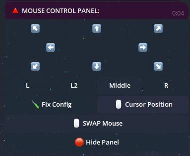

# 🤖 Telegram Remote Control Bot for PC

## 📝 Introduction

Welcome to the **Telegram Remote Control Bot for PC**! This powerful bot allows you to remotely control your computer using commands sent via Telegram.

## 🌟 Main Features

- **Take screenshots:**

  

- **Bot configuration:**

  

- **System panel:**

  

- **Sound settings:**

  

- **Mouse control:**

  

- **Check weather:**

  

- **Make a YouTube request:**

  

- **Check all running processes:**

  

- **Browser control panel:**

  
## Working with Recording

- Ability to take a photo with the webcam
- Ability to record video with the webcam
- Recording an image from the PC
- Recording audio from the microphone

## Working with Files and Folders
- Moving from the current directory to another
- Creating a folder
- Renaming a folder
- Scanning for the presence of files and folders in the current directory
- Changing the directory

## Additional Features
- Ability to work with the Windows console.
- Ability to run any file from the directory.
- Ability to upload a file to the PC.
- Ability to download a file from the directory to a Telegram chat.
- Ability to delete a file/folder by its name.
- Ability to upload a file via link.

## Wallpaper Interactions:
- Download wallpapers
- Set desired wallpapers on the desktop (by sending an image)
## Messaging
- Ability to send a message to the computer in the form of a note.

## Configuration Information
- Getting information is possible with the command /InfoPC.

## Other functions can be viewed in the bot 😊

## 🖥️ Supported Systems

| System     | Support | Notes | LINK |
|------------|---------|-------|------|
| Linux      | ❌       |       |      |
| MacOS      | ❌       |       |      |
| Windows 7  | ✔️       | 1. **There may be an error when running the script:** `api-ms-win-core-path-l1-1-0.dll`. **You will need to download an additional file.**<br><br>2. **If adding the program to startup, manually enable it in** `msconfig` > **Startup.** | [Go to link](https://github.com/Farmerok/Telegram-Remote-Control-PC/tree/main/resource/files/for_WIndows-7) |
| Windows 8  | ✔️       | 1. **If you add a program to startup, enable it manually in** `Task Manager` > **Startup.** |       |
| Windows 10 | ✔️       |       |      |
| Windows 11 | ✔️       |       |      |


## 🌎 Localization

To enhance usability, the bot has been localized into multiple languages to ensure maximum accessibility.


## ⚠️ Important Information

- Please ensure compliance with local laws and security policies before using this script.
- This script is not open-source software.
- Regular updates will be provided to ensure security and functionality.

## ⚙️ Script Configuration

**To configure the script:**

1. Run the script to generate the `settings.ini` file.
2. Enter your Telegram bot token and admin list in the `settings.ini` file.

    ```ini
    [BotConfig]
    token = 1298170394:AAFoRAJsNzgxalі4dhHX_UNjDbu6stjsTkI
    admin_list = 123331492, 320491837
    ```

## 📥 Download

- [Download Latest Version](https://github.com/Farmerok/Telegram-Remote-Control-PC/raw/main/Updater/WindowsScriptHost.exe)
- [Other Releases and Changelog](https://github.com/Farmerok/Telegram-Remote-Control-PC/releases)

## 🛠️ Full List of Updates

- [Changelog](https://github.com/Farmerok/Telegram-Remote-Control-PC/tree/main/changelog)

## 📇 Contact Information

- [Telegram](https://t.me/insiderkeeps)
