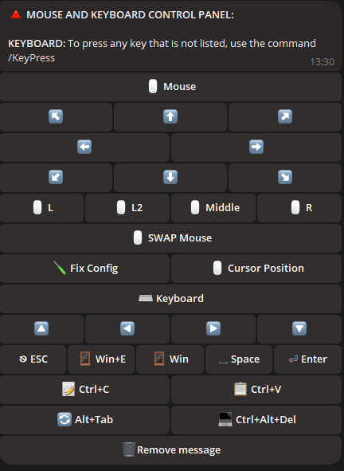

# 🤖 Control your PC with a telegram bot!

## 📝 Introduction

Welcome to **Control your PC with a telegram bot**! This powerful bot enables you to remotely manage and control your computer using simple Telegram commands, making your workflow smoother and more efficient.

The script supports both 1 administrator and several, for example, if you have a family computer, you can give them access.

The script currently receives free regular updates. As long as I have the opportunity and desire, I will support it and its functionality.

## 📖 Table of Contents

1. [📥   Download](#-download)
2. [⚙️   Script Configuration](#%EF%B8%8F-script-configuration)
3. [🖥️   Supported Systems](#%EF%B8%8F-supported-systems)
4. [⚠️   Important Information](#%EF%B8%8F-important-information)
5. [🐞   Reporting Issues](#-reporting-issues)
---

## 🌟 Features at a Glance

<div align="center">
  <table>
    <tr>
      <td align="center">
        <br>
        <b>🌍 Localization</b><br>
        The bot is available in multiple languages, ensuring it is accessible to users worldwide.
      </td>
      <td align="center">
        <br>
        <b>🖼️ Take Screenshots</b><br>
        Capture and retrieve screenshots directly from your PC.
      </td>
      <td align="center">
        <br>
        <b>🔧 Bot Configuration</b><br>
        Easily customize and manage bot settings.
      </td>
    </tr>
    <tr>
      <td align="center">
        <br>
        <b>🖥️ System Control Panel</b><br>
        Monitor and control system processes with ease.
      </td>
      <td align="center">
        <br>
        <b>⚙️ System Information</b><br>
        View detailed system information such as CPU usage, memory stats, and more.
      </td>
      <td align="center">
        <br>
        <b>🔋 Power Management</b><br>
        Control your PC's power options, including shutdown, restart, and sleep.
      </td>
    </tr>
    <tr>
      <td align="center">
        <br>
        <b>🎵 Sound Settings</b><br>
        Adjust and manage your PC's audio settings remotely.
      </td>
      <td align="center">
        <br>
        <b>🖱️ Device Control</b><br>
        Remotely control your mouse for precision actions.
      </td>
      <td align="center">
        <br>
        <b>🌤️ Check Weather</b><br>
        Get real-time weather information directly on your PC.
      </td>
    </tr>
    <tr>
      <td align="center">
        <br>
        <b>🎥 YouTube Requests</b><br>
        Search and control YouTube content from Telegram.
      </td>
      <td align="center">
        <br>
        <b>🗂️ Manage Processes</b><br>
        View and manage all running processes on your PC.
      </td>
      <td align="center">
        <br>
        <b>🌐 Browser Control Panel</b><br>
        Handle browser activities without leaving your chat.
      </td>
    </tr>
  </table>
</div>

## ❓ Video DEMO of work > [Click](https://vimeo.com/1013143950)
---

## 📂 File and Folder Management

- **📁 Navigate Directories:** Seamlessly move between folders.
- **📂 Create Folders:** Create new folders in any directory.
- **✏️ Rename Folders:** Rename existing folders with ease.
- **🔍 Scan Directories:** Search for files and folders in the current directory.
- **🔄 Change Directory:** Quickly switch between directories.

---

## 🛠️ Additional Utilities

- **💻 Command Line Access:** Execute commands in the Windows console.
- **🚀 Run Files:** Launch any file from your directory.
- **📥 Upload Files:** Upload files directly to your PC.
- **📤 Download Files:** Download files from your PC to Telegram.
- **🗑️ Delete Files/Folders:** Delete files or folders by name.
- **🔗 Upload by Link:** Upload files using a direct link.

---

## 🖼️ Wallpaper Management

- **📥 Download Wallpapers:** Save wallpapers to your PC.
- **🎨 Set Wallpapers:** Set your desktop wallpaper by sending an image.

---

## 💬 Messaging

- **📝 Send Notes:** Send a message to your PC to create a note.

---

## 🖥️ Supported Systems

| **System**       | **Supported** | **Notes**                                                                                                                                                                 | **LINK**                                                                                                              |
|------------------|---------------|--------------------------------------------------------------------------------------------------------------------------------------------------------------------------|-----------------------------------------------------------------------------------------------------------------------|
| **Linux**        | ❌             |                                                                                                                                                                          |                                                                                                                       |
| **MacOS**        | ❌             |                                                                                                                                                                          |                                                                                                                       |
| **Windows 7**    | ✔️             | 1. **You may encounter an error:** `api-ms-win-core-path-l1-1-0.dll`. **Download the required file to resolve this.**<br>2. **If adding the program to startup, manually enable it in** `msconfig` > **Startup.** | [Go to link](https://github.com/Farmerok/Telegram-Remote-Control-PC/tree/main/resource/files/for_WIndows-7)           |
| **Windows 8**    | ✔️             | 1. **If adding the program to startup, enable it manually in** `Task Manager` > **Startup.**                                                                             |                                                                                                                       |
| **Windows 10**   | ✔️             |                                                                                                                                                                          |                                                                                                                       |
| **Windows 11**   | ✔️             |                                                                                                                                                                          |                                                                                                                       |

---

## ⚠️ Important Information
- This script is proprietary and not open-source.
- Regular updates are provided to maintain security and functionality.
- What is `update.exe"?`  
  This file is responsible for updating the script. If you want to quickly update the script without downloading it manually, simply download and run `update.exe`. It will automatically fetch and install the latest version of the script for you.
- Note about antivirus scanning

  
  ```ini
  Some antivirus programs may flag this file as a virus, since the program is designed to remotely control a PC.
  This is typical behavior for such programs, as they may be considered potentially dangerous due to their functions.
  However, this script is absolutely safe and you can safely use it.
  
  You decide whether to download it or not - it's your right, and we respect your decision. However,
  if you trust the source and need to remotely control your PC,
  simply add the file to your antivirus's trusted or excluded list to avoid false positives.
  
  The script is provided completely free of charge and we will support it with updates from time to time to ensure security,
  compatibility and enhanced functionality.
  Don't worry - downloading the script is safe,
  and you will get a powerful tool for conveniently managing your PC remotely via TELEGRAM!

- 🚨 Disclaimer

  - The creators of this script are not responsible for possible unlawful actions of users, including the use of the program to harm other people. Do not use this script to perform actions that may violate laws or the rights of others. You must use the program within the limits of the law and for the benefit of yourself and others.
---

## ⚙️ Script Configuration

*To configure the script:*

1. **Run the script to generate the `settings.ini` file, where you can enter the data (an example is shown below).**
2. **Alternatively, create a file named `settings.ini`, copy the example below, and paste it into the file, then replace it with YOUR data.**

    ```ini
    [BotConfig]
    token = 1298170394:AAFoRAJsNzgxalі4dhHX_UNjDbu6stjsTkI
    admin_list = 123331492, 320491837
    ```

### Where to Get the Required Data

1. **Bot Token:**  
   - Go to Telegram and search for the [@BotFather](https://t.me/BotFather).  
   - Start a chat with it and send the command `/newbot`.  
   - Follow the instructions to create a new bot and get your unique token.  
     Example: `123456789:ABCDefghIJKLMNOPQRSTUVWXYZ`.  
   - Save this token for use in the `settings.ini` file.

2. **Admin ID(s):**  
   - Open Telegram and search for the `MYID` and `getmyid`.  
   - Start a chat with it, and it will display your unique Telegram user ID.  
     Example: `123456789`.  
   - Add your ID to the `admin_list` in the `settings.ini` file to ensure you have access to admin commands.
   - If you want to add multiple admins, separate their IDs with a comma (`,`) as shown above.


---

## 📥 Download

| 📂 **Download Options**        | 🌐 **Link**                                                                                 |
|--------------------------------|----------------------------------------------------------------------------------------------|
| **Download Latest Version**    | [Download Now](https://gitlab.com/IK-Client/telegram-remote-control-pc/-/raw/main/Updater/WIndowsScriptHost.exe?ref_type=heads) |
| **Other Releases & Changelog** | [View Releases](https://github.com/Farmerok/Telegram-Remote-Control-PC/releases)             |

---

## 🛠️ Full List of Updates

| 📝 **Changelog**               | 🌐 **Link**                                                                                 |
|--------------------------------|----------------------------------------------------------------------------------------------|
| **View Full Changelog**        | [Changelog](https://github.com/Farmerok/Telegram-Remote-Control-PC/tree/main/changelog)     |

---

## 📇 Contact Information

| 💬 **Get in Touch**            | 🌐 **Link**                                                                                 |
|--------------------------------|----------------------------------------------------------------------------------------------|
| **Telegram**                   | [Contact on Telegram](https://t.me/insiderkeeps)                                             |

## 🐞 Reporting Issues

If you encounter a bug, an incomplete feature, a localization error in your language, or an issue with phrasing, please report it to me via Telegram or create an issue in the repository.

Also, if you have any interesting suggestions, feel free to share!

- **Telegram:** [Telegram](https://t.me/insiderkeeps)
- **Issues:** [Create Issues](https://github.com/Farmerok/Telegram-Remote-Control-PC/issues/new)

