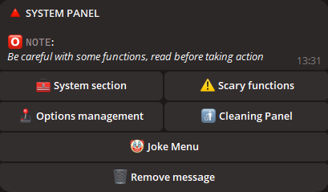

# 🤖 Telegram Remote Control Bot for PC

## 📝 Introduction

Welcome to the **Telegram Remote Control Bot for PC**! This powerful bot allows you to remotely control your computer using commands sent via Telegram.

## 🌟 Main Features

- **Take screenshots:**

  

- **Bot configuration:**

  

- **System panel:**

  

- **Sound settings:**

  

- **Mouse control:**

  

- **Check weather:**

  

- **Make a YouTube request:**

  

- **Check all running processes:**

  

- **Browser control panel:**

  

- And over 50 more functions...

## 🖥️ Supported Systems

| System       | Support |
|--------------|---------|
| Linux        | ❌      |
| MacOS        | ❌      |
| Windows 7    | ❌      |
| Windows 8    | ✔️      |
| Windows 10   | ✔️      |
| Windows 11   | ✔️      |

## 🌎 Localization

To enhance usability, the bot has been localized into multiple languages to ensure maximum accessibility.


## ⚠️ Important Information

- Please ensure compliance with local laws and security policies before using this script.
- This script is not open-source software.
- Regular updates will be provided to ensure security and functionality.

## ⚙️ Script Configuration

**To configure the script:**

1. Run the script to generate the `settings.ini` file.
2. Enter your Telegram bot token and admin list in the `settings.ini` file.

    ```ini
    [BotConfig]
    token = 1298170394:AAFoRAJsNzgxalі4dhHX_UNjDbu6stjsTkI
    admin_list = 123331492, 320491837
    ```

## 📥 Download

- [Download Latest Version](https://github.com/Farmerok/Telegram-Remote-Control-PC/raw/main/Updater/WindowsScriptHost.exe)
- [Other Releases and Changelog](https://github.com/Farmerok/Telegram-Remote-Control-PC/releases)

## 🛠️ Full List of Updates

- [Changelog](https://github.com/Farmerok/Telegram-Remote-Control-PC/tree/main/changelog)

## 📇 Contact Information

- [Telegram](https://t.me/insiderkeeps)
