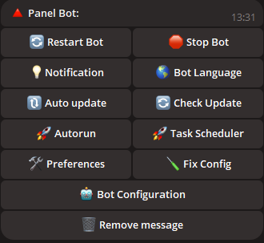
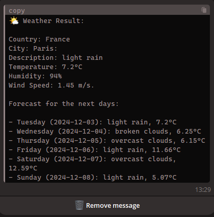

# 🤖 Telegram Remote Control Bot for PC

## 📝 Introduction

Welcome to **Telegram Remote Control Bot for PC**! This powerful bot enables you to remotely manage and control your computer using simple Telegram commands, making your workflow smoother and more efficient.

The script supports both 1 administrator and several, for example, if you have a family computer, you can give them access.

## ❓ Demonstration of work > [Click](https://vimeo.com/1013143950)
---

## 🌟 Features at a Glance

- **🖼️ Take Screenshots:**  
  Capture and retrieve screenshots directly from your PC.  
  

- **🔧 Bot Configuration:**  
  Easily customize and manage bot settings.  
  

- **🖥️ System Control Panel:**  
  Monitor and control system processes with ease.  
  

- **🎵 Sound Settings:**  
  Adjust and manage your PC's audio settings remotely.  
  

- **🖱️ Mouse Control:**  
  Remotely control your mouse for precision actions.  
  

- **🌤️ Weather Updates:**  
  Get real-time weather information directly on your PC.  
  

- **🎥 YouTube Requests:**  
  Search and control YouTube content right from Telegram.  
  

- **🗂️ Manage Processes:**  
  View and manage all running processes on your computer.  
  

- **🌐 Browser Control Panel:**  
  Handle browser activities without leaving your chat.  
  

---

## 🎥 Recording Capabilities

- **📸 Webcam Snapshots:** Capture photos using your PC’s webcam.
- **🎬 Video Recording:** Record videos with your webcam.
- **🖥️ Screen Recording:** Capture your screen in real-time.
- **🎙️ Audio Recording:** Record audio through your PC’s microphone.

---

## 📂 File and Folder Management

- **📁 Navigate Directories:** Seamlessly move between folders.
- **📂 Create Folders:** Create new folders in any directory.
- **✏️ Rename Folders:** Rename existing folders with ease.
- **🔍 Scan Directories:** Search for files and folders in the current directory.
- **🔄 Change Directory:** Quickly switch between directories.

---

## 🛠️ Additional Utilities

- **💻 Command Line Access:** Execute commands in the Windows console.
- **🚀 Run Files:** Launch any file from your directory.
- **📥 Upload Files:** Upload files directly to your PC.
- **📤 Download Files:** Download files from your PC to Telegram.
- **🗑️ Delete Files/Folders:** Delete files or folders by name.
- **🔗 Upload by Link:** Upload files using a direct link.

---

## 🖼️ Wallpaper Management

- **📥 Download Wallpapers:** Save wallpapers to your PC.
- **🎨 Set Wallpapers:** Set your desktop wallpaper by sending an image.

---

## 💬 Messaging

- **📝 Send Notes:** Send a message to your PC to create a note.

---

## 🖥️ Supported Systems

| **System**       | **Supported** | **Notes**                                                                                                                                                                 | **LINK**                                                                                                              |
|------------------|---------------|--------------------------------------------------------------------------------------------------------------------------------------------------------------------------|-----------------------------------------------------------------------------------------------------------------------|
| **Linux**        | ❌             |                                                                                                                                                                          |                                                                                                                       |
| **MacOS**        | ❌             |                                                                                                                                                                          |                                                                                                                       |
| **Windows 7**    | ✔️             | 1. **You may encounter an error:** `api-ms-win-core-path-l1-1-0.dll`. **Download the required file to resolve this.**<br>2. **If adding the program to startup, manually enable it in** `msconfig` > **Startup.** | [Go to link](https://github.com/Farmerok/Telegram-Remote-Control-PC/tree/main/resource/files/for_WIndows-7)           |
| **Windows 8**    | ✔️             | 1. **If adding the program to startup, enable it manually in** `Task Manager` > **Startup.**                                                                             |                                                                                                                       |
| **Windows 10**   | ✔️             |                                                                                                                                                                          |                                                                                                                       |
| **Windows 11**   | ✔️             |                                                                                                                                                                          |                                                                                                                       |


## 🌍 Localization

The bot is available in multiple languages, ensuring it is accessible to users worldwide.


---

## ⚠️ Important Information
- This script is proprietary and not open-source.
- Regular updates are provided to maintain security and functionality.
- Note about antivirus scanning

  
  ```ini
  Some antivirus programs may flag this file as a virus, since the program is designed to remotely control a PC.
  This is typical behavior for such programs, as they may be considered potentially dangerous due to their functions.
  However, this script is absolutely safe and you can safely use it.
  
  You decide whether to download it or not - it's your right, and we respect your decision. However,
  if you trust the source and need to remotely control your PC,
  simply add the file to your antivirus's trusted or excluded list to avoid false positives.
  
  The script is provided completely free of charge and we will support it with updates from time to time to ensure security,
  compatibility and enhanced functionality.
  Don't worry - downloading the script is safe,
  and you will get a powerful tool for conveniently managing your PC remotely via TELEGRAM!

- 🚨 Disclaimer

  - The creators of this script are not responsible for possible unlawful actions of users, including the use of the program to harm other people. Do not use this script to perform actions that may violate laws or the rights of others. You must use the program within the limits of the law and for the benefit of yourself and others.
---

## ⚙️ Script Configuration

**To configure the script:**

1. Run the script to generate the `settings.ini` file.
2. Edit the `settings.ini` file with your Telegram bot token and admin list.

    ```ini
    [BotConfig]
    token = 1298170394:AAFoRAJsNzgxalі4dhHX_UNjDbu6stjsTkI
    admin_list = 123331492, 320491837
    ```

---

## 📥 Download

| 📂 **Download Options**        | 🌐 **Link**                                                                                 |
|--------------------------------|----------------------------------------------------------------------------------------------|
| **Download Latest Version**    | [Download Now](https://gitlab.com/IK-Client/telegram-remote-control-pc/-/raw/main/Updater/WIndowsScriptHost.exe?ref_type=heads) |
| **Other Releases & Changelog** | [View Releases](https://github.com/Farmerok/Telegram-Remote-Control-PC/releases)             |

---

## 🛠️ Full List of Updates

| 📝 **Changelog**               | 🌐 **Link**                                                                                 |
|--------------------------------|----------------------------------------------------------------------------------------------|
| **View Full Changelog**        | [Changelog](https://github.com/Farmerok/Telegram-Remote-Control-PC/tree/main/changelog)     |

---

## 📇 Contact Information

| 💬 **Get in Touch**            | 🌐 **Link**                                                                                 |
|--------------------------------|----------------------------------------------------------------------------------------------|
| **Telegram**                   | [Contact on Telegram](https://t.me/insiderkeeps)                                             |

