## 📝 مقدمة

مرحبًا بك في **PCGuardControl**! هذه الأداة القوية تتيح لك التحكم عن بُعد في جهاز الكمبيوتر الخاص بك من خلال أوامر بسيطة عبر تيليجرام، مما يجعل عملك أكثر راحة وكفاءة.

يدعم السكربت مشرفًا واحدًا أو عدة مشرفين. على سبيل المثال، على جهاز كمبيوتر عائلي، يمكنك منح الوصول لأفراد أسرتك.

نقوم بإصدار تحديثات مجانية بشكل دوري للحفاظ على وظائف السكربت وأمانه.

---

## 🌟 الميزات الأساسية

<div align="center">
  <table>
    <tr>
      <td align="center">
        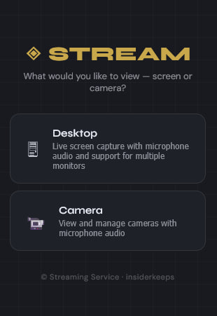<br>
        <b>🔧 تنقل سهل</b><br>
        تبديل سهل بين إدارة الكاميرا وسطح المكتب والميكروفون.
      </td>
      <td align="center">
        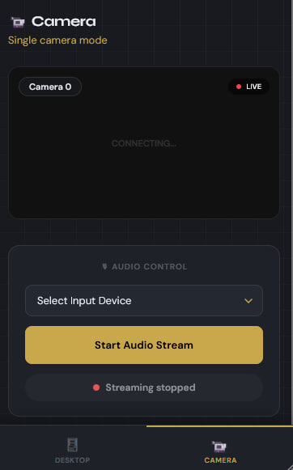<br>
        <b>📸 مراقبة الفيديو</b><br>
        بث الفيديو من الكاميرات لمراقبة منزلك.
      </td>
      <td align="center">
        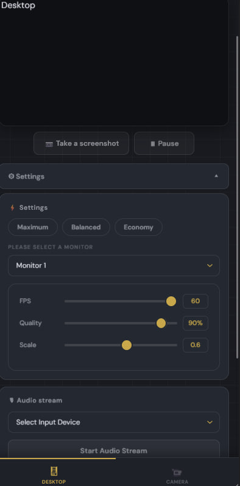<br>
        <b>📸 بث الشاشة</b><br>
        راقب سطح المكتب من هاتفك أو أي جهاز آخر.
      </td>
    </tr>
    <tr>
      <td align="center">
        <br>
        <b>🌍 دعم اللغات</b><br>
        البوت متاح بعدة لغات لراحة المستخدمين حول العالم.
      </td>
      <td align="center">
        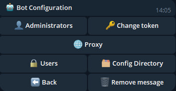<br>
        <b>🤖 إعداد البوت</b><br>
        غيّر التوكن، أضف أو احذف المشرفين مباشرة من البوت.
      </td>
      <td align="center">
        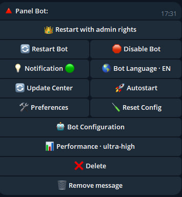<br>
        <b>🔧 إدارة الإعدادات</b><br>
        قم بضبط إعدادات البوت بسرعة وسهولة.
      </td>
    </tr>
    <tr>
      <td align="center">
        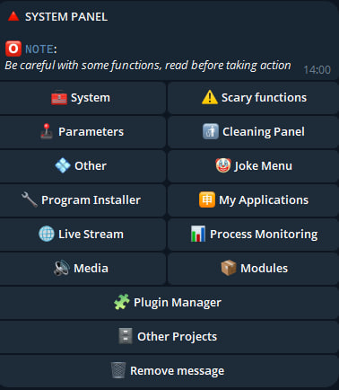<br>
        <b>🖥️ إدارة النظام</b><br>
        واجهة سهلة للتفاعل مع النظام.
      </td>
      <td align="center">
        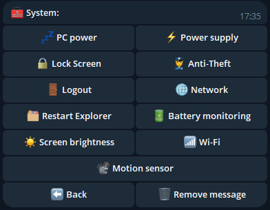<br>
        <b>⚙️ معلومات النظام</b><br>
        تحكم في الطاقة وخطط استهلاكها وقفل الشاشة أو تسجيل الخروج.
      </td>
      <td align="center">
        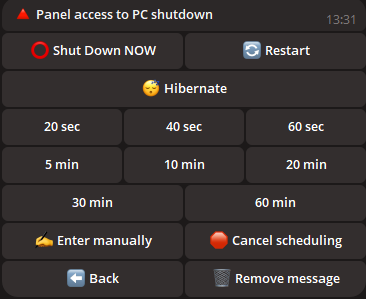<br>
        <b>🔋 إدارة الطاقة</b><br>
        أطفئ، أعد التشغيل، انقل الجهاز لوضع السكون أو جدول إيقاف التشغيل.
      </td>
    </tr>
    <tr>
      <td align="center">
        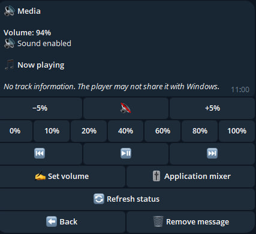<br>
        <b>🎵 إعداد الصوت</b><br>
        اضبط مستوى الصوت في الكمبيوتر عن بُعد.
      </td>
      <td align="center">
        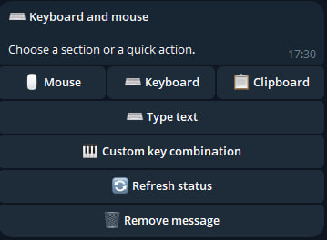<br>
        <b>🖱️ إدارة الأجهزة</b><br>
        تحكم بالماوس ولوحة المفاتيح عن بُعد.
      </td>
      <td align="center">
        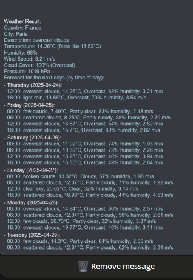<br>
        <b>🌤️ الطقس</b><br>
        احصل على بيانات الطقس الحالية مباشرة داخل البوت.
      </td>
    </tr>
    <tr>
      <td align="center">
        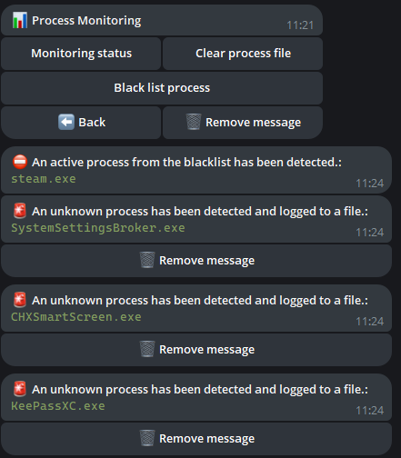<br>
        <b>🎥 مراقبة العمليات</b><br>
        تابع العمليات وأضفها إلى القائمة السوداء وتحكم في العمليات الجديدة.
      </td>
      <td align="center">
        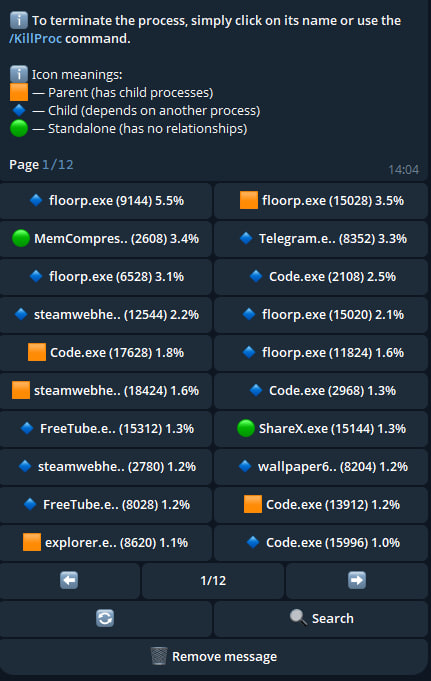<br>
        <b>🗂️ إدارة العمليات</b><br>
        اعرض العمليات الجارية ومواردها وأنهها عند الحاجة.
      </td>
      <td align="center">
        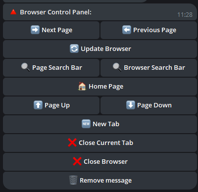<br>
        <b>🌐 إدارة المتصفح</b><br>
        نفّذ إجراءات في المتصفح مباشرة من الدردشة.
      </td>
    </tr>
    <tr>
      <td align="center">
        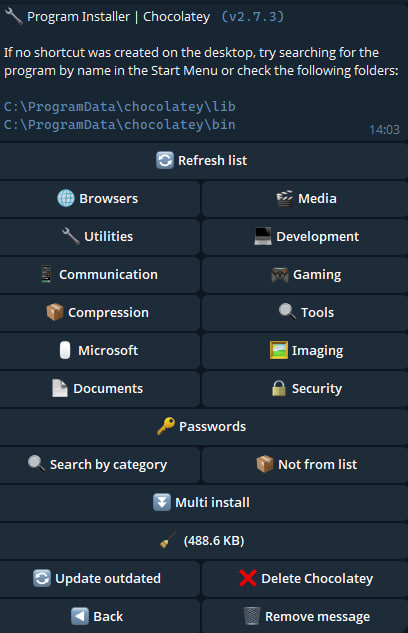<br>
        <b>🔧 تثبيت البرامج</b><br>
        أعدت تثبيت ويندوز؟ ابحث عن البرامج المطلوبة حسب الفئة أو عبر البحث. إذا لم يكن البرنامج في القائمة، أدخل اسمه للتثبيت.
      </td>
      <td align="center">
        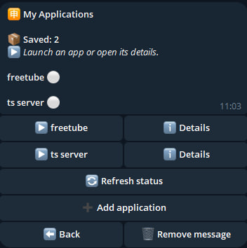<br>
        <b>🈸 تطبيقاتي</b><br>
        أضف التطبيقات إلى القائمة، أعطها أسماء، وشغّلها من القائمة.
      </td>
      <td align="center">
        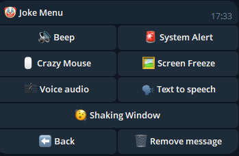<br>
        <b>🤡 وظائف مزحة</b><br>
        امزح مع من يحاول استخدام جهازك: شغّل صوتًا عشوائيًا، لحنًا، أو اقفل الشاشة.
      </td>
      <td align="center">
        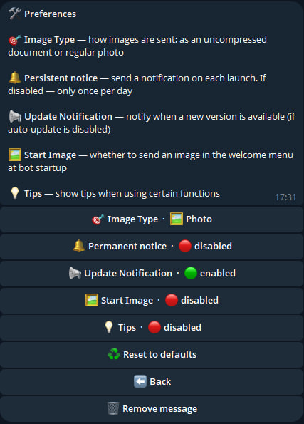<br>
        <b>🛠️ التخصيص</b><br>
        اضبط البوت: صيغة الصور، إشعارات الإصدارات، قفل الشاشة، وغيرها.
      </td>
    </tr>
    <tr>
      <td align="center">
        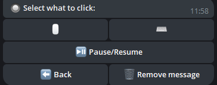<br>
        <b>🔘 النقر التلقائي</b><br>
        شغّل النقر التلقائي للماوس أو لوحة المفاتيح مباشرة من البوت.
      </td>
      <td align="center">
        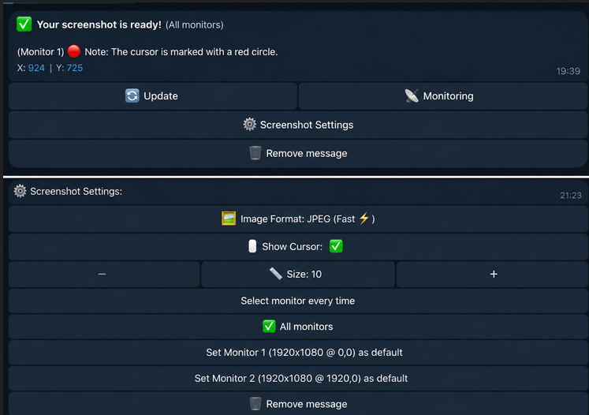<br>
        <b>🖼️ لقطات الشاشة</b><br>
        التقط لقطات شاشة من جهازك واستلمها في تيليجرام.
      </td>
      <td align="center">
        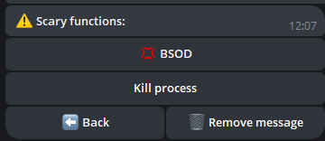<br>
        <b>🖼️ وظائف متطرفة</b><br>
        اختبر نفسك: فعّل شاشة الموت الزرقاء (BSOD) أو أنهِ جميع العمليات!
      </td>
    </tr>
  </table>
</div>

---

## 📂 إدارة الملفات والمجلدات

- **📁 التنقل بين المجلدات:** تبديل سريع بين المجلدات.
- **📂 إنشاء المجلدات:** أنشئ مجلدات جديدة في أي مكان.
- **✏️ إعادة التسمية:** غيّر أسماء المجلدات الحالية.
- **🔍 المسح:** استعرض الملفات والمجلدات في الدليل الحالي.
- **🔄 تغيير الدليل:** انتقل بسهولة بين المجلدات.

---

## 🛠️ وظائف إضافية

- **💻 سطر الأوامر:** نفّذ أوامر في وحدة تحكم ويندوز.
- **🚀 تشغيل الملفات:** افتح الملفات من أي دليل.
- **📥 رفع الملفات:** أرسل ملفات إلى الجهاز.
- **📤 تنزيل الملفات:** استلم الملفات من الجهاز عبر تيليجرام.
- **🗑️ الحذف:** احذف الملفات أو المجلدات بالاسم.
- **🔗 التنزيل عبر رابط:** نزّل الملفات باستخدام روابط مباشرة.
- **👮 مكافحة السرقة:** اقفل الشاشة عند أي نشاط.
- **✍️ إدخال النص:** اكتب نصًا على الجهاز عبر البوت.
- **🗣 الرسائل الصوتية:** أرسل رسائل صوتية تُشغَّل على الجهاز.
- **📦 الحافظة:** اعرض وعدّل محتوى الحافظة.
- **👀 مراقبة الحافظة:** تتبّع تغييرات الحافظة في الوقت الفعلي مع إشعارات.
- **🛡️ جدار الحماية:** فعّل/عطّل الحماية مباشرة من البوت.
- **🖥 إدارة الشاشة:** شغّل/أطفئ الشاشة.
- **⌨️ قفل الإدخال:** قيّد الوصول إلى الماوس ولوحة المفاتيح.
- **🪫 مراقبة البطارية:** احصل على إشعارات عند انخفاض شحن اللابتوب.
- **🗂 إعادة تشغيل المستكشف:** أعد تشغيل مستكشف ويندوز.

---

## 🖼️ إدارة الخلفيات

- **📥 تنزيل الخلفيات:** احفظ الصور على الجهاز.
- **🎨 تعيين الخلفية:** غيّر خلفية سطح المكتب بإرسال صورة.

---

## 💬 الإشعارات

- **📝 إرسال الإشعارات:** أنشئ ملاحظات وإشعارات نظام على الجهاز.

---

## 🖥️ الأنظمة المدعومة

| **النظام**       | **الدعم** | **ملاحظات**                                                                                   | **الرابط** |
|------------------|-----------|--------------------------------------------------------------------------------------------------|------------|
| **Linux**        | ❌        |                                                                                                  |            |
| **MacOS**        | ❌        |                                                                                                  |            |
| **Windows 7**    | ✔️        | لتفعيل التشغيل التلقائي، أضف البرنامج في `msconfig` > **بدء التشغيل**.                          |            |
| **Windows 8**    | ✔️        | لتفعيل التشغيل التلقائي، أضف البرنامج في `مدير المهام` > **بدء التشغيل**.                        |            |
| **Windows 10**   | ✔️        |                                                                                                  |            |
| **Windows 11**   | ✔️        |                                                                                                  |            |

---

## ⚠️ معلومات مهمة

- السكربت مملوك وليس مفتوح المصدر.
- التحديثات الدورية تضمن الأمان والميزات الجديدة.
- **ما هو `update.exe`؟**  
  هذا ملف للتحديث التلقائي للسكربت. شغّله لتنزيل أحدث إصدار دون تثبيت يدوي.
- **⚠️ لا تستخدم توكن واحد في عدة برامج في نفس الوقت** — استخدمه في تطبيق واحد فقط.
- **حول تنبيهات مكافحة الفيروسات:**

  ```ini
  قد تقوم بعض برامج مكافحة الفيروسات بوضع علامة على السكربت كتهديد، لأنه مصمم للتحكم عن بُعد بالجهاز.
  هذا سلوك طبيعي بالنسبة لهذا النوع من البرامج بسبب وظائفها.
  السكربت آمن تمامًا للاستخدام.

  القرار بتنزيله من عدمه يعود لك بالكامل، ونحن نحترم ذلك. إذا كنت تثق بالمصدر،
  أضف الملف إلى استثناءات مضاد الفيروسات لتجنب التنبيهات الكاذبة.

  السكربت متاح مجانًا، وسنستمر في تحديثه لضمان الأمان والوظائف.
  التنزيل آمن، وستحصل على أداة قوية للتحكم بجهاز الكمبيوتر عبر تيليجرام!
  ```

- **🚨 إخلاء مسؤولية:**  
  لا يتحمل المطورون مسؤولية أي استخدام غير قانوني للسكربت. لا تستخدمه في أفعال تنتهك القانون أو حقوق الآخرين. استخدم البرنامج لأغراض مشروعة فقط.

---

## ⚙️ إعداد السكربت

للإعداد:

1. شغّل السكربت لإنشاء ملف `settings.ini` لإدخال البيانات (مثال أدناه).
2. أو أنشئ ملف `settings.ini` بنفسك، انسخ المثال، واستبدل البيانات ببياناتك.

```ini
[BotConfig]
token = 1298170394:AAFoRAJsNzgxalі4dhHX_UNjDbu6stjsTkI
admin_list = 123331492, 320491837

[Proxy]
use_proxy = False
proxy_type = http
proxy_url = ip:port
proxy_user = 
proxy_pass = 
```

> 💡 قسم `[Proxy]` اختياري — إذا لم تكن بحاجة لبروكسي، اترك `use_proxy = False` أو لا تضف القسم إطلاقًا، وسينشئه السكربت تلقائيًا.

---

### 🌐 إعداد البروكسي (اختياري)

إذا كان تيليجرام محظورًا في بلدك أو ترغب باستخدام بروكسي — عدّل قسم `[Proxy]` في `settings.ini`:

**مع اسم مستخدم وكلمة مرور:**
```ini
[Proxy]
use_proxy = True
proxy_type = http
proxy_url = 45.67.89.10:3128
proxy_user = mylogin
proxy_pass = mypassword
```

**بدون اسم مستخدم وكلمة مرور:**
```ini
[Proxy]
use_proxy = True
proxy_type = http
proxy_url = 45.67.89.10:3128
proxy_user = 
proxy_pass = 
```

**الأنواع المدعومة:** `http`, `https`, `socks5`

> ⚠️ **مهم:**
> - البروكسيات المجانية غير مستقرة وتعمل لمدة 1-2 ساعة فقط. للاستخدام الدائم، يُنصح باستخدام بروكسي مدفوع أو خاص.
> - إذا لم يكن البروكسي متاحًا عند التشغيل — سيحاول البوت الاتصال تلقائيًا 3 مرات، ثم يعطّل البروكسي ويعمل مباشرة.
> - إذا تعطّل البروكسي أثناء التشغيل — سيتحول البوت تلقائيًا إلى الاتصال المباشر ويُشعرك بذلك عبر تيليجرام.
> - يمكن إعداد أو تغيير البروكسي مباشرة من البوت: **لوحة البوت ← إعدادات البوت ← البروكسي**.

### كيفية الحصول على البيانات

1. **توكن البوت:**  
   - ابحث في تيليجرام عن [@BotFather](https://t.me/BotFather).  
   - أرسل الأمر `/newbot` واتبع التعليمات لإنشاء بوت.  
   - احصل على التوكن، مثال: `123456789:ABCDefghIJKLMNOPQRSTUVWXYZ`.  
   - احفظه في `settings.ini`.

2. **معرف المشرف (ID):**  
   - ابحث في تيليجرام عن `@userinfobot` أو `@getmyid_bot`.  
   - ابدأ محادثة للحصول على معرف تيليجرام الخاص بك، مثال: `123456789`.  
   - أضف المعرف إلى `admin_list` في `settings.ini`. لعدة مشرفين، افصل بين المعرفات بفاصلة (`,`).