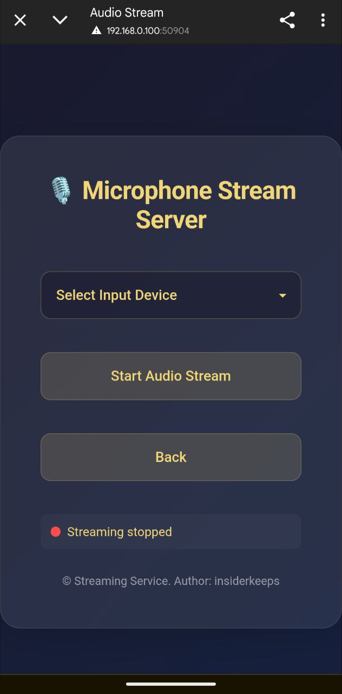
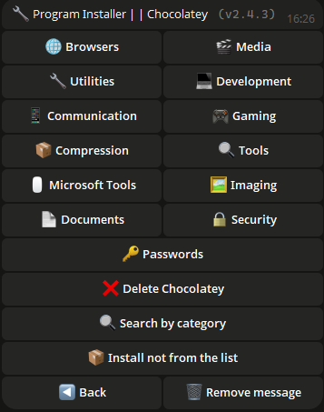

## 📝 Einführung

Willkommen bei **Steuere deinen PC mit einem Telegram-Bot**! Dieser leistungsstarke Bot ermöglicht es dir, deinen Computer remote über einfache Telegram-Befehle zu steuern, was deine Arbeit bequemer und effizienter macht.

Das Skript unterstützt sowohl einen einzelnen Administrator als auch mehrere Administratoren. Wenn du beispielsweise einen Familiencomputer verwendest, kannst du deinen Angehörigen Zugang gewähren.

Das Skript erhält regelmäßig kostenlose Updates. Solange ich die Möglichkeit und den Wunsch habe, werde ich die Funktionalität weiterhin unterstützen.

---

## 🌟 Hauptfunktionen

<div align="center">
  <table>
   <tr>
      <td align="center">
      <br>
      <b>🔧 Einfache Navigation zwischen Kamera, Desktop und Mikrofon.</b><br>
      Möchten Sie Überwachung oder Mikrofon-Ton aktivieren? Wählen Sie selbst.
    </td>
    <td align="center">
      <br>
      <b>📸 Kamera-Übertragung</b><br>
      Sehen Sie den Livestream Ihrer Kameras, um Ihr Zuhause zu überwachen.
    </td>
    <td align="center">
      <br>
      <b>📸 Bildschirm-Übertragung</b><br>
      Beobachten Sie Ihren Desktop, egal ob vom Handy oder einem anderen PC.
    </td>
    <td align="center">
      <br>
      <b>📸 Mikrofon-Übertragung</b><br>
      Hören Sie den Ton in Echtzeit von Ihrem Mikrofon, egal ob vom Handy oder einem anderen PC.
    </td>
    </tr>
    <tr>
      <td align="center">
        <br>
        <b>🌍 Lokalisierung</b><br>
        Der Bot ist in mehreren Sprachen verfügbar und bietet Benutzern weltweit Komfort.
      </td>
      <td align="center">
        <br>
        <b>🤖 Bot-Konfiguration</b><br>
        Ändern Sie den Token, fügen Sie Administratoren hinzu oder entfernen Sie sie direkt über den Bot.
      </td>
      <td align="center">
        <br>
        <b>🔧 Bot-Einstellungen</b><br>
        Konfigurieren und verwalten Sie die Bot-Parameter einfach.
      </td>
    </tr>
    <tr>
      <td align="center">
        <br>
        <b>🖥️ Systemsteuerungs-Navigationspanel</b><br>
        Bequeme Navigation mit Ihrem System.
      </td>
      <td align="center">
        <br>
        <b>⚙️ Systeminformationen</b><br>
        Interagieren Sie mit der PC-Stromversorgung, ändern Sie den Energieplan, sperren Sie den Bildschirm, führen Sie einen schnellen Sperrvorgang durch oder melden Sie sich ab.
      </td>
      <td align="center">
        <br>
        <b>🔋 Energieverwaltung</b><br>
        Verwalten Sie die Energieoptionen Ihres PCs, einschließlich Herunterfahren, Neustart und Ruhezustand, oder planen Sie das Ausschalten Ihres PCs.
      </td>
    </tr>
    <tr>
      <td align="center">
        <br>
        <b>🎵 Toneinstellungen</b><br>
        Passen Sie den Ton Ihres PCs aus der Ferne an und verwalten Sie ihn.
      </td>
      <td align="center">
        <br>
        <b>🖱️ Geräteverwaltung</b><br>
        Steuern Sie Maus und Tastatur aus der Ferne.
      </td>
      <td align="center">
        <br>
        <b>🌤️ Wetterprüfung</b><br>
        Erhalten Sie aktuelle Wetterinformationen direkt im Bot!
      </td>
    </tr>
    <tr>
      <td align="center">
        <br>
        <b>🎥 Prozessüberwachung</b><br>
        Fügen Sie Prozesse, die überwacht werden sollen, zur Blacklist hinzu und verfolgen Sie die Aktivität neuer Prozesse.
      </td>
      <td align="center">
        <br>
        <b>🗂️ Prozessverwaltung</b><br>
        Anzeigen und Verwalten aller laufenden Prozesse auf Ihrem PC, Überprüfen der Ressourcennutzung und Beenden von Prozessen.
      </td>
      <td align="center">
        <br>
        <b>🌐 Browser-Steuerungspanel</b><br>
        Verwalten Sie Browseraktionen direkt aus dem Chat.
      </td>
    </tr>
    <tr>
    <td align="center">
        <br>
        <b>🔧 Programm-Installer</b><br>
        Windows neu installiert? Möchten Sie keine Zeit mit der Suche nach den benötigten Programmen im Internet verschwenden? Nutzen Sie diese Funktion! Hier sind verschiedene Anwendungen nach Kategorien geordnet. Sie können die Kategoriesuche verwenden, um das benötigte Programm zu finden. Wenn es nicht in der Liste ist, verwenden Sie einfach den Button „Nicht in der Liste“, geben Sie den Paketnamen ein, und das System schlägt eine passende Option vor.
      </td>
      <td align="center">
        <br>
        <b>🈸 Meine Anwendungen</b><br>
        Fügen Sie Ihre Anwendungen zur Liste hinzu, geben Sie ihnen eigene Namen und starten Sie sie aus diesem Menü.
      </td>
      <td align="center">
        <br>
        <b>🤡 Spaß-Menü</b><br>
        Möchten Sie sich amüsieren, wenn Sie vom Computer weg sind und jemand versucht, darauf zuzugreifen? 
        Spielen Sie zufällige Audiodateien ab, starten Sie eine zufällige Melodie, frieren Sie den Bildschirm ein oder nutzen Sie andere Funktionen.
      </td>
      <td align="center">
        <br>
        <b>🛠️ Einstellungen</b><br>
        Passen Sie den Bot nach Ihren Wünschen an.
        Möchten Sie Fotos als "Dokument" erhalten? > Umschalten.
        Möchten Sie keine Benachrichtigung über neue Versionen? > Deaktivieren.
        Möchten Sie keine Bildschirmsperre bei Aktivitätserkennung? > Deaktivieren.
      </td>
    </tr>
    <tr>
      <td align="center">
        <br>
        <b>🔘 Klicker</b><br>
        Starten Sie einen Auto-Klicker für Maus oder Tastatur direkt aus dem Bot.
      </td>
      <td align="center">
        <br>
        <b>🖼️ Screenshots erstellen</b><br>
        Machen und erhalten Sie Screenshots direkt von Ihrem PC in Telegram.
      </td>
      <td align="center">
        <br>
        <b>🖼️ Panel für extreme Funktionen</b><br>
        Möchten Sie sich herausfordern? Dieses Menü ist für Sie.
        Starten Sie einen BSOD oder schließen Sie alle Prozesse!
      </td>
    </tr>
  </table>
</div>


---

## 📂 Datei- und Ordnerverwaltung

- **📁 Ordnernavigation:** Wechsle bequem zwischen Verzeichnissen.
- **📂 Ordner erstellen:** Erstelle neue Ordner in jedem Verzeichnis.
- **✏️ Ordner umbenennen:** Benenne vorhandene Ordner einfach um.
- **🔍 Verzeichnisse durchsuchen:** Finde Dateien und Ordner im aktuellen Verzeichnis.
- **🔄 Verzeichnis wechseln:** Wechsle schnell zwischen Verzeichnissen.

---

## 🛠️ Zusätzliche Tools

- **💻 Zugriff auf die Eingabeaufforderung:** Führen Sie Befehle in der Windows-Konsole aus.
- **🚀 Dateien starten:** Öffnen Sie beliebige Dateien aus Ihrem Verzeichnis.
- **📥 Dateien hochladen:** Laden Sie Dateien direkt auf Ihren PC hoch.
- **📤 Dateien herunterladen:** Laden Sie Dateien von Ihrem PC in Telegram herunter.
- **🗑️ Dateien und Ordner löschen:** Löschen Sie Dateien oder Ordner nach Namen.
- **🔗 Herunterladen über Link:** Laden Sie Dateien über einen direkten Link herunter.
- **🛜 WiFi-Bruteforce:** Finden Sie das Passwort für einen ausgewählten Zugangspunkt.
- **👮 Diebstahlschutz:** Sperren Sie den Bildschirm bei jeglicher PC-Aktivität.
- **✍️ Texteingabe:** Schreiben Sie Text auf Ihrem PC direkt über den Bot.
- **🗣 Sprachnachricht:** Senden Sie dem Bot eine Sprachnachricht, und sie wird auf Ihrem PC mit Ihrer Stimme wiedergegeben.
- **📦 Zwischenablage:** Anzeigen und Bearbeiten des Inhalts der Zwischenablage.
- **🛡️ Firewall:** Aktivieren/Deaktivieren Sie den Firewall-Schutz direkt im Bot.
- **🖥 Monitor:** Schalten Sie den Monitor direkt im Bot ein oder aus.
- **⌨️ Zugriffssperre:** Sperren Sie den Zugriff auf Maus und Tastatur für die gewünschte Zeit.
---

## 🖼️ Hintergrundbildverwaltung

- **📥 Hintergrundbilder herunterladen:** Speichere Hintergrundbilder auf deinem PC.
- **🎨 Hintergrundbilder festlegen:** Setze einen Desktop-Hintergrund, indem du ein Bild sendest.

---

## 💬 Nachrichten senden

- **📝 Notizen senden:** Sende Nachrichten an deinen PC, um Notizen zu erstellen.

## 🖥️ Unterstützte Systeme

| **System**       | **Unterstützt** | **Hinweise**                                                                                                                                                                 | **LINK**                                                                                                              |
|------------------|-----------------|-----------------------------------------------------------------------------------------------------------------------------------------------------------------------------|-----------------------------------------------------------------------------------------------------------------------|
| **Linux**        | ❌               |                                                                                                                                                                           |                                                                                                                       |
| **MacOS**        | ❌               |                                                                                                                                                                           |                                                                                                                       |
| **Windows 7**    | ✔️               | **Wenn Sie das Programm zum Autostart hinzufügen, aktivieren Sie es manuell in** `msconfig` > **Autostart.** |
| **Windows 8**    | ✔️               | 1. **Wenn Sie das Programm zum Autostart hinzufügen, aktivieren Sie es manuell im** `Task-Manager` > **Autostart.**                                                           |                                                                                                                       |
| **Windows 10**   | ✔️               |                                                                                                                                                                           |                                                                                                                       |
| **Windows 11**   | ✔️               |                                                                                                                                                                           |                                                                                                                       |

---

## ⚠️ Wichtige Informationen
- Dieses Skript ist proprietär und nicht Open-Source.
- Regelmäßige Updates werden bereitgestellt, um Sicherheit und Funktionalität zu gewährleisten.
- Was ist `update.exe`?  
  Diese Datei ist für die Aktualisierung des Skripts verantwortlich. Wenn Sie das Skript schnell aktualisieren möchten, ohne es manuell herunterzuladen, laden Sie einfach `update.exe` herunter und führen Sie es aus. Es wird automatisch die neueste Version des Skripts abrufen und installieren.
- Hinweis zur Antivirus-Überprüfung

  
  ```ini
  Einige Antivirenprogramme markieren diese Datei möglicherweise als Virus, da das Programm entwickelt wurde, um einen PC aus der Ferne zu steuern.
  Dies ist typisches Verhalten für solche Programme, da sie aufgrund ihrer Funktionen als potenziell gefährlich angesehen werden können.
  Dieses Skript ist jedoch absolut sicher, und Sie können es bedenkenlos verwenden.
  
  Es liegt in Ihrer Entscheidung, ob Sie es herunterladen oder nicht - es ist Ihr Recht, und wir respektieren Ihre Entscheidung. Wenn Sie jedoch der Quelle vertrauen und Ihren PC aus der Ferne steuern müssen,
  fügen Sie die Datei einfach der Liste der vertrauenswürdigen oder ausgeschlossenen Dateien in Ihrem Antivirenprogramm hinzu, um falsche Positivmeldungen zu vermeiden.
  
  Das Skript wird vollständig kostenlos bereitgestellt, und wir unterstützen es von Zeit zu Zeit mit Updates, um Sicherheit,
  Kompatibilität und erweiterte Funktionalität zu gewährleisten.
  Machen Sie sich keine Sorgen - das Herunterladen des Skripts ist sicher,
  und Sie erhalten ein leistungsstarkes Tool zur bequemen Verwaltung Ihres PCs über TELEGRAM!

- 🚨 Haftungsausschluss

  - Die Ersteller dieses Skripts sind nicht für mögliche rechtswidrige Handlungen von Benutzern verantwortlich, einschließlich der Verwendung des Programms, um anderen Schaden zuzufügen. Verwenden Sie dieses Skript nicht, um Handlungen vorzunehmen, die gegen Gesetze oder die Rechte anderer verstoßen. Sie müssen das Programm im Rahmen des Gesetzes und zum Nutzen von sich selbst und anderen verwenden.

---

## ⚙️ Skript-Konfiguration

*So konfigurieren Sie das Skript:*

1. **Führen Sie das Skript aus, um die Datei `settings.ini` zu generieren, in der Sie die Daten eingeben können (ein Beispiel ist unten gezeigt).**
2. **Alternativ können Sie eine Datei namens `settings.ini` erstellen, das Beispiel unten kopieren und in die Datei einfügen, dann mit IHREN Daten ersetzen.**

    ```ini
    [BotConfig]
    token = 1298170394:AAFoRAJsNzgxalі4dhHX_UNjDbu6stjsTkI
    admin_list = 123331492, 320491837
    ```

### Wo Sie die erforderlichen Daten erhalten

1. **Bot-Token:**  
   - Gehen Sie zu Telegram und suchen Sie nach [@BotFather](https://t.me/BotFather).  
   - Starten Sie einen Chat mit ihm und senden Sie den Befehl `/newbot`.  
   - Befolgen Sie die Anweisungen, um einen neuen Bot zu erstellen und Ihr einzigartiges Token zu erhalten.  
     Beispiel: `123456789:ABCDefghIJKLMNOPQRSTUVWXYZ`.  
   - Speichern Sie dieses Token für die Verwendung in der Datei `settings.ini`.

2. **Admin-ID(s):**  
   - Öffnen Sie Telegram und suchen Sie nach `MYID` und `getmyid`.  
   - Starten Sie einen Chat mit ihm, und es wird Ihre einzigartige Telegram-Benutzer-ID angezeigt.  
     Beispiel: `123456789`.  
   - Fügen Sie Ihre ID zur `admin_list` in der Datei `settings.ini` hinzu, um sicherzustellen, dass Sie Zugriff auf Admin-Befehle haben.
   - Wenn Sie mehrere Admins hinzufügen möchten, trennen Sie deren IDs mit einem Komma (`,`) wie oben gezeigt.
