## 📝 Einführung

Willkommen bei **PCGuardControl**! Dieses leistungsstarke Tool ermöglicht dir die Fernsteuerung deines Computers über einfache Telegram-Befehle, wodurch deine Arbeit bequemer und effizienter wird.

Das Skript unterstützt einen oder mehrere Administratoren. Beispielsweise kannst du auf einem Familien-PC deinen Angehörigen Zugriff gewähren.

Wir veröffentlichen regelmäßig kostenlose Updates, um die Sicherheit und Funktionalität des Skripts zu gewährleisten.

---

## 🌟 Hauptfunktionen

<div align="center">
  <table>
    <tr>
      <td align="center">
        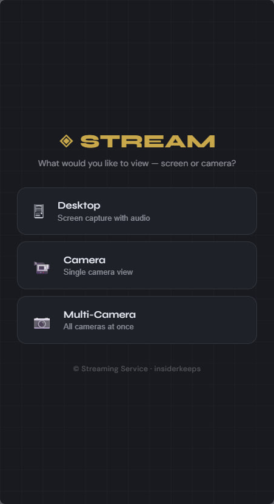<br>
        <b>🔧 Intuitive Navigation</b><br>
        Wechsle einfach zwischen Kamera, Desktop und Mikrofon.
      </td>
      <td align="center">
        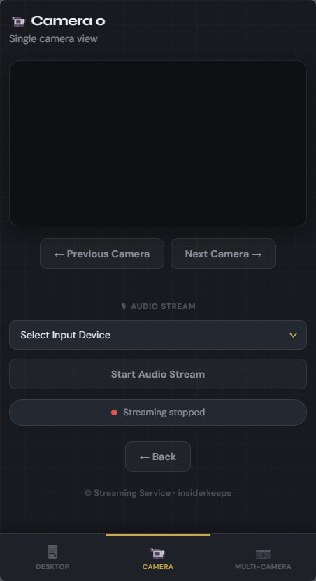<br>
        <b>📸 Videoüberwachung</b><br>
        Streame Videos von deinen Kameras zur Überwachung deines Hauses.
      </td>
      <td align="center">
        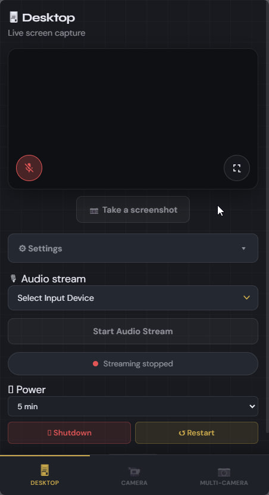<br>
        <b>📸 Bildschirm-Streaming</b><br>
        Beobachte deinen Desktop von einem Handy oder einem anderen Gerät.
      </td>
    </tr>
    <tr>
      <td align="center">
        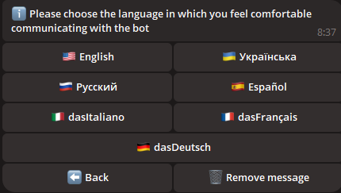<br>
        <b>🌍 Mehrsprachige Unterstützung</b><br>
        Der Bot ist in mehreren Sprachen verfügbar für Nutzer weltweit.
      </td>
      <td align="center">
        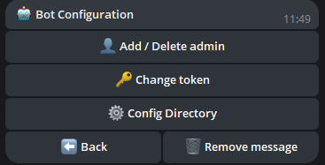<br>
        <b>🤖 Bot-Konfiguration</b><br>
        Ändere den Token, füge Administratoren hinzu oder entferne sie direkt im Bot.
      </td>
      <td align="center">
        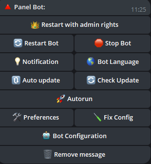<br>
        <b>🔧 Einstellungsverwaltung</b><br>
        Konfiguriere die Bot-Parameter schnell und einfach.
      </td>
    </tr>
    <tr>
      <td align="center">
        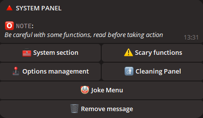<br>
        <b>🖥️ Systemsteuerung</b><br>
        Praktische Schnittstelle zur Interaktion mit deinem System.
      </td>
      <td align="center">
        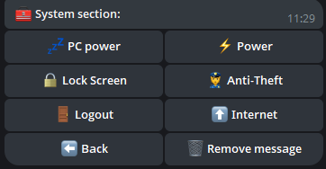<br>
        <b>⚙️ Systeminformationen</b><br>
        Verwalte Stromversorgung, Energiepläne, Bildschirmsperre oder Abmeldung.
      </td>
      <td align="center">
        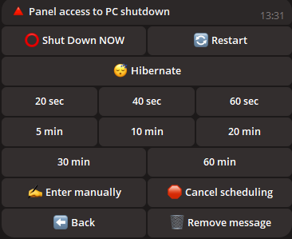<br>
        <b>🔋 Energiemanagement</b><br>
        Schalte den PC aus, starte ihn neu, aktiviere den Ruhezustand oder plane ein Herunterfahren.
      </td>
    </tr>
    <tr>
      <td align="center">
        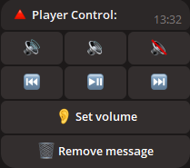<br>
        <b>🎵 Audioeinstellungen</b><br>
        Passe den Ton deines PCs aus der Ferne an.
      </td>
      <td align="center">
        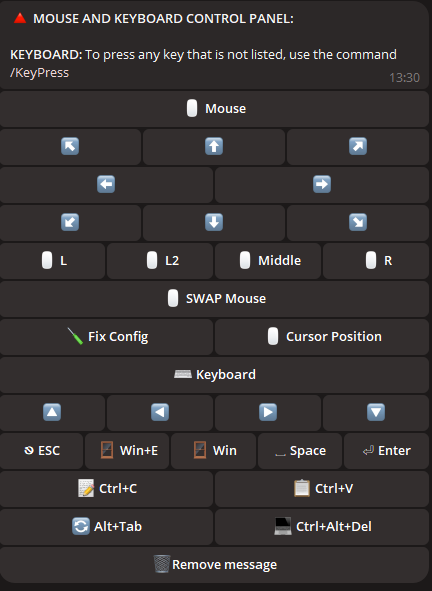<br>
        <b>🖱️ Gerätesteuerung</b><br>
        Steuere Maus und Tastatur aus der Ferne.
      </td>
      <td align="center">
        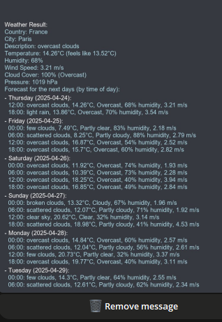<br>
        <b>🌤️ Wetter</b><br>
        Erhalte aktuelle Wetterinformationen direkt im Bot.
      </td>
    </tr>
    <tr>
      <td align="center">
        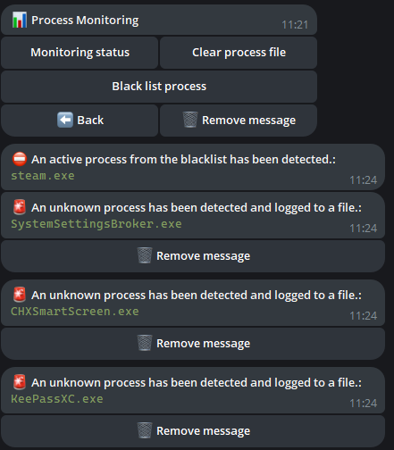<br>
        <b>🎥 Prozessüberwachung</b><br>
        Verfolge Prozesse, indem du sie auf eine Blacklist setzt, und überwache neue Starts.
      </td>
      <td align="center">
        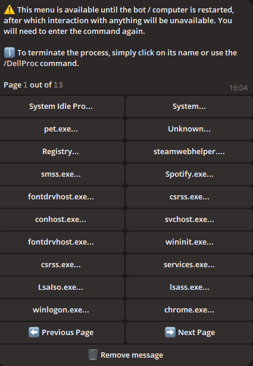<br>
        <b>🗂️ Prozessverwaltung</b><br>
        Zeige laufende Prozesse, ihre Ressourcen an und beende sie bei Bedarf.
      </td>
      <td align="center">
        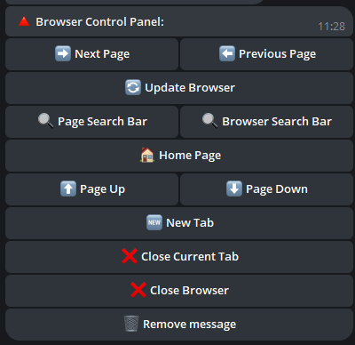<br>
        <b>🌐 Browsersteuerung</b><br>
        Führe Aktionen im Browser direkt aus dem Chat aus.
      </td>
    </tr>
    <tr>
      <td align="center">
        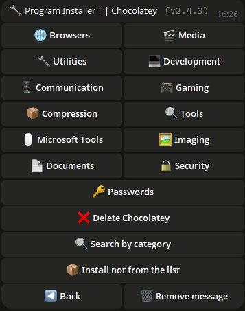<br>
        <b>🔧 Programm-Installation</b><br>
        Windows neu installiert? Finde Programme nach Kategorien oder Suche. Wenn ein Programm nicht gelistet ist, gib seinen Namen ein, um es zu installieren.
      </td>
      <td align="center">
        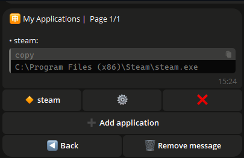<br>
        <b>🈸 Meine Anwendungen</b><br>
        Füge Anwendungen zu einer Liste hinzu, gib ihnen Namen und starte sie aus diesem Menü.
      </td>
      <td align="center">
        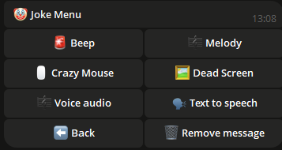<br>
        <b>🤡 Unterhaltsame Funktionen</b><br>
        Spiele Streiche mit denen, die deinen PC benutzen: Spiele zufällige Audios, Melodien oder sperre den Bildschirm.
      </td>
      <td align="center">
        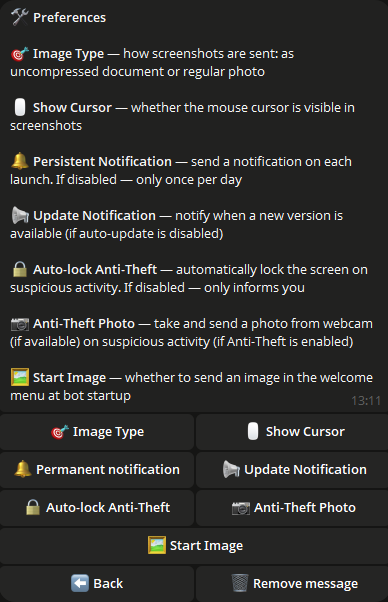<br>
        <b>🛠️ Personalisierung</b><br>
        Passe den Bot an: Bildformate, Update-Benachrichtigungen, Bildschirmsperre usw.
      </td>
    </tr>
    <tr>
      <td align="center">
        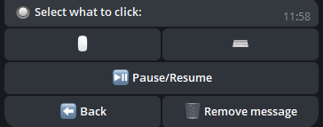<br>
        <b>🔘 Autoklicker</b><br>
        Starte einen Autoklicker für Maus oder Tastatur direkt im Bot.
      </td>
      <td align="center">
        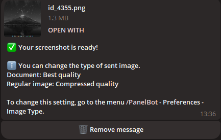<br>
        <b>🖼️ Screenshots</b><br>
        Erstelle und empfange Screenshots deines PCs auf Telegram.
      </td>
      <td align="center">
        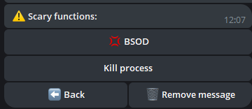<br>
        <b>🖼️ Extreme Funktionen</b><br>
        Teste deine Grenzen: Löse einen BSOD aus oder beende alle Prozesse!
      </td>
    </tr>
  </table>
</div>

---

## 📂 Verwaltung von Dateien und Ordnern

- **📁 Ordnernavigation:** Wechsle schnell zwischen Verzeichnissen.
- **📂 Ordner erstellen:** Erstelle neue Ordner an beliebigen Orten.
- **✏️ Umbenennen:** Ändere die Namen bestehender Ordner.
- **🔍 Scannen:** Überprüfe Dateien und Ordner im aktuellen Verzeichnis.
- **🔄 Verzeichniswechsel:** Navigiere einfach zwischen Ordnern.

---

## 🛠️ Zusätzliche Funktionen

- **💻 Eingabeaufforderung:** Führe Befehle in der Windows-Konsole aus.
- **🚀 Dateien starten:** Öffne Dateien aus beliebigen Verzeichnissen.
- **📥 Datei-Upload:** Sende Dateien an deinen PC.
- **📤 Datei-Download:** Lade Dateien von deinem PC auf Telegram herunter.
- **🗑️ Löschen:** Entferne Dateien oder Ordner nach Namen.
- **🔗 Download über Link:** Lade Dateien über direkte Links herunter.
- **👮 Diebstahlschutz:** Sperre den Bildschirm bei jeglicher Aktivität.
- **✍️ Texteingabe:** Gib Text auf deinem PC über den Bot ein.
- **🗣 Sprachnachrichten:** Sende Sprachnachrichten, die auf dem PC abgespielt werden.
- **📦 Zwischenablage:** Zeige und bearbeite den Inhalt der Zwischenablage.
- **👀 Zwischenablage-Überwachung:** Echtzeit-Verfolgung von Änderungen in der Zwischenablage mit Benachrichtigungen.
- **🛡️ Firewall:** Aktiviere/deaktiviere den Schutz direkt im Bot.
- **🖥 Monitorsteuerung:** Schalte den Monitor ein/aus.
- **⌨️ Eingabesperre:** Beschränke den Zugriff auf Maus und Tastatur.
- **🪫 Akkukontrolle:** Erhalte Benachrichtigungen bei niedrigem Akkustand.
- **🗂 Explorer-Neustart:** Starte den Windows-Explorer neu.

---

## 🖼️ Hintergrundbild-Verwaltung

- **📥 Hintergrundbilder herunterladen:** Speichere Bilder auf deinem PC.
- **🎨 Hintergrundbild einstellen:** Ändere den Desktop-Hintergrund, indem du ein Bild sendest.

---

## 💬 Benachrichtigungen

- **📝 Benachrichtigungen senden:** Erstelle Notizen und Systembenachrichtigungen auf deinem PC.

---

## 🖥️ Unterstützte Systeme

| **System**       | **Unterstützung** | **Hinweise**                                                                                   | **Link** |
|------------------|-------------------|------------------------------------------------------------------------------------------------|----------|
| **Linux**        | ❌                |                                                                                                |          |
| **MacOS**        | ❌                |                                                                                                |          |
| **Windows 7**    | ✔️                | Aktiviere das Programm manuell in `msconfig` > **Autostart**.                                   |          |
| **Windows 8**    | ✔️                | Aktiviere das Programm manuell in `Task-Manager` > **Autostart**.                               |          |
| **Windows 10**   | ✔️                |                                                                                                |          |
| **Windows 11**   | ✔️                |                                                                                                |          |

---

## ⚠️ Wichtige Informationen

- Das Skript ist proprietär und nicht Open Source.
- Regelmäßige Updates gewährleisten Sicherheit und neue Funktionen.
- **Was ist `update.exe`?**  
  Diese Datei dient der automatischen Aktualisierung des Skripts. Führe sie aus, um die neueste Version ohne manuelle Installation herunterzuladen.
- **⚠️ Verwende denselben Token nicht gleichzeitig in mehreren Programmen** — nur in einer Anwendung.
- **Zu Antiviren-Warnungen:**

  ```ini
  Manche Antivirenprogramme könnten das Skript als Bedrohung markieren, da es für die Fernsteuerung des PCs gedacht ist.
  Dies ist normales Verhalten für derartige Programme aufgrund ihrer Funktionalität.
  Das Skript ist absolut sicher zu verwenden.

  Du entscheidest, ob du es herunterladen möchtest – das ist dein Recht, und wir respektieren es. Wenn du der Quelle vertraust,
  füge die Datei zu den Ausnahmen deines Antivirenprogramms hinzu, um Fehlalarme zu vermeiden.

  Das Skript wird kostenlos bereitgestellt, und wir werden es regelmäßig aktualisieren, um Sicherheit und Funktionalität zu gewährleisten.
  Der Download ist sicher, und du erhältst ein leistungsstarkes Tool zur Steuerung deines PCs über Telegram!
  ```

- **🚨 Haftungsausschluss:**  
  Die Entwickler übernehmen keine Verantwortung für die illegale Nutzung des Skripts. Verwende es nicht für Handlungen, die gegen Gesetze oder die Rechte anderer verstoßen. Nutze das Programm nur für legale Zwecke.

---

## ⚙️ Skript-Einrichtung

Zur Konfiguration:

1. Starten Sie das Skript, um die Datei `settings.ini` zu erstellen (Beispiel unten).
2. Oder erstellen Sie `settings.ini` manuell, kopieren Sie das Beispiel und ersetzen Sie die Daten.

```ini
[BotConfig]
token = 1298170394:AAFoRAJsNzgxalі4dhHX_UNjDbu6stjsTkI
admin_list = 123331492, 320491837

[Proxy]
use_proxy = False
proxy_type = http
proxy_url = ip:port
proxy_user = 
proxy_pass = 
```

> 💡 Der Abschnitt `[Proxy]` ist optional — wenn kein Proxy benötigt wird, lassen Sie `use_proxy = False` oder lassen Sie den Abschnitt weg, das Skript erstellt ihn automatisch.

---

### 🌐 Proxy-Einrichtung (optional)

Wenn Telegram in Ihrem Land gesperrt ist oder Sie einen Proxy verwenden möchten — bearbeiten Sie den Abschnitt `[Proxy]` in `settings.ini`:

**Mit Login und Passwort:**
```ini
[Proxy]
use_proxy = True
proxy_type = http
proxy_url = 45.67.89.10:3128
proxy_user = mylogin
proxy_pass = mypassword
```

**Ohne Login und Passwort:**
```ini
[Proxy]
use_proxy = True
proxy_type = http
proxy_url = 45.67.89.10:3128
proxy_user = 
proxy_pass = 
```

**Unterstützte Typen:** `http`, `https`, `socks5`

> ⚠️ **Wichtig:**
> - Kostenlose Proxys sind instabil und halten 1–2 Stunden. Für den Dauereinsatz wird ein kostenpflichtiger oder eigener Proxy empfohlen.
> - Wenn der Proxy beim Start nicht verfügbar ist — versucht der Bot automatisch 3 Mal, danach deaktiviert er den Proxy und startet direkt.
> - Wenn der Proxy während des Betriebs ausfällt — wechselt der Bot automatisch zur direkten Verbindung und benachrichtigt Sie in Telegram.
> - Den Proxy können Sie direkt im Bot konfigurieren: **Bot-Panel → Bot-Konfiguration → Proxy**.

### Wie du die Daten erhältst

1. **Bot-Token:**  
   - Suche auf Telegram nach [@BotFather](https://t.me/BotFather).  
   - Sende den Befehl `/newbot` und folge den Anweisungen, um einen Bot zu erstellen.  
   - Erhalte den Token, z. B.: `123456789:ABCDefghIJKLMNOPQRSTUVWXYZ`.  
   - Speichere ihn in `settings.ini`.

2. **Administrator-ID:**  
   - Suche auf Telegram nach `@userinfobot` oder `@getmyid_bot`.  
   - Starte einen Chat, um deine Telegram-ID zu erhalten, z. B.: `123456789`.  
   - Füge die ID zu `admin_list` in `settings.ini` hinzu. Für mehrere Administratoren trenne die IDs durch Kommas (`,`).