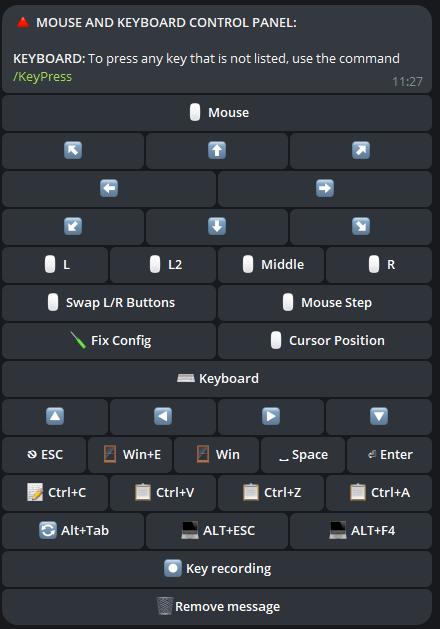

## 📝 Introduction

Welcome to **Control Your PC with a Telegram Bot**! This powerful bot allows you to remotely control your computer using simple Telegram commands, making your work more convenient and efficient.

The script supports both a single administrator and multiple administrators. For example, if you are using a family computer, you can grant access to your loved ones.

The script regularly receives free updates. As long as I have the ability and desire, I will maintain its functionality.

---

## 🌟 Key Features

<div align="center">
  <table>
    <tr>
      <td align="center">
        <br>
        <b>🌍 Localization</b><br>
        The bot is available in multiple languages, providing convenience for users almost anywhere in the world.
      </td>
      <td align="center">
        <br>
        <b>🖼️ Screenshot Creation</b><br>
        Take and receive screenshots directly from your PC on Telegram.
      </td>
      <td align="center">
        <br>
        <b>🔧 Bot Configuration</b><br>
        Easily configure and manage bot settings.
      </td>
    </tr>
    <tr>
      <td align="center">
        <br>
        <b>🖥️ System Control Navigation Panel</b><br>
        Convenient navigation with your system.
      </td>
      <td align="center">
        <br>
        <b>⚙️ System Information</b><br>
        Interact with PC power, change power plans, use the screen lock feature, quick lock, check disk statuses, and log out of the system.
      </td>
      <td align="center">
        <br>
        <b>🔋 Power Management</b><br>
        Manage your PC's power options, including shutdown, restart, hibernate mode, or schedule a shutdown.
      </td>
    </tr>
    <tr>
      <td align="center">
        <br>
        <b>🎵 Sound Settings</b><br>
        Configure and manage your PC's sound remotely.
      </td>
      <td align="center">
        <br>
        <b>🖱️ Device Control</b><br>
        Remotely control your mouse and keyboard.
      </td>
      <td align="center">
        <br>
        <b>🌤️ Weather Check</b><br>
        Get up-to-date weather information directly in the bot!
      </td>
    </tr>
    <tr>
      <td align="center">
        <br>
        <b>🎥 YouTube Queries</b><br>
        Search for content on YouTube via Telegram.
      </td>
      <td align="center">
        <br>
        <b>🗂️ Process Management</b><br>
        View and manage all running processes on your PC, monitor their usage, and terminate them.
      </td>
      <td align="center">
        <br>
        <b>🌐 Browser Control Panel</b><br>
        Manage browser actions directly from the chat.
      </td>
    </tr>
  </table>
</div>


---

## 📂 File and Folder Management

- **📁 Move between folders:** Easily switch between directories.
- **📂 Create folders:** Create new folders in any directory.
- **✏️ Rename folders:** Easily rename existing folders.
- **🔍 Scan directories:** Find files and folders in the current directory.
- **🔄 Change directory:** Quickly switch between directories.

---

## 🛠️ Additional Utilities

- **💻 Command line access:** Execute commands in the Windows console.
- **🚀 Run files:** Open any files from your directory.
- **📥 Upload files:** Upload files directly to your PC.
- **📤 Download files:** Download files from your PC to Telegram.
- **🗑️ Delete files and folders:** Delete files or folders by name.
- **🔗 Download from link:** Download files from a direct link.

---

## 🖼️ Wallpaper Management

- **📥 Download wallpapers:** Save wallpapers to your PC.
- **🎨 Set wallpaper:** Set your desktop wallpaper by sending an image.

---

## 💬 Send Messages

- **📝 Send notes:** Send messages to your PC for creating notes.

## 🖥️ Supported Systems

| **System**       | **Supported** | **Notes**                                                                                                                                                                 | **LINK**                                                                                                              |
|------------------|---------------|--------------------------------------------------------------------------------------------------------------------------------------------------------------------------|-----------------------------------------------------------------------------------------------------------------------|
| **Linux**        | ❌             |                                                                                                                                                                          |                                                                                                                       |
| **MacOS**        | ❌             |                                                                                                                                                                          |                                                                                                                       |
| **Windows 7**    | ✔️             | 1. **You may encounter an error:** `api-ms-win-core-path-l1-1-0.dll`. **Download the required file to resolve this.**<br>2. **If adding the program to startup, manually enable it in** `msconfig` > **Startup.** | [Go to link](https://github.com/Farmerok/Telegram-Remote-Control-PC/tree/main/docs/resource/files/for_WIndows-7)           |
| **Windows 8**    | ✔️             | 1. **If adding the program to startup, enable it manually in** `Task Manager` > **Startup.**                                                                             |                                                                                                                       |
| **Windows 10**   | ✔️             |                                                                                                                                                                          |                                                                                                                       |
| **Windows 11**   | ✔️             |                                                                                                                                                                          |                                                                                                                       |

---

## ⚠️ Important Information
- This script is proprietary and not open-source.
- Regular updates are provided to maintain security and functionality.
- What is `update.exe`?  
  This file is responsible for updating the script. If you want to quickly update the script without downloading it manually, simply download and run `update.exe`. It will automatically fetch and install the latest version of the script for you.
- Note about antivirus scanning

  
  ```ini
  Some antivirus programs may flag this file as a virus, since the program is designed to remotely control a PC.
  This is typical behavior for such programs, as they may be considered potentially dangerous due to their functions.
  However, this script is absolutely safe and you can safely use it.
  
  You decide whether to download it or not - it's your right, and we respect your decision. However,
  if you trust the source and need to remotely control your PC,
  simply add the file to your antivirus's trusted or excluded list to avoid false positives.
  
  The script is provided completely free of charge and we will support it with updates from time to time to ensure security,
  compatibility, and enhanced functionality.
  Don't worry - downloading the script is safe,
  and you will get a powerful tool for conveniently managing your PC remotely via TELEGRAM!

- 🚨 Disclaimer

  - The creators of this script are not responsible for possible unlawful actions of users, including the use of the program to harm other people. Do not use this script to perform actions that may violate laws or the rights of others. You must use the program within the limits of the law and for the benefit of yourself and others.

---

## ⚙️ Script Configuration

*To configure the script:*

1. **Run the script to generate the `settings.ini` file, where you can enter the data (an example is shown below).**
2. **Alternatively, create a file named `settings.ini`, copy the example below, and paste it into the file, then replace it with YOUR data.**

    ```ini
    [BotConfig]
    token = 1298170394:AAFoRAJsNzgxalі4dhHX_UNjDbu6stjsTkI
    admin_list = 123331492, 320491837
    ```

### Where to Get the Required Data

1. **Bot Token:**  
   - Go to Telegram and search for [@BotFather](https://t.me/BotFather).  
   - Start a chat with it and send the command `/newbot`.  
   - Follow the instructions to create a new bot and get your unique token.  
     Example: `123456789:ABCDefghIJKLMNOPQRSTUVWXYZ`.  
   - Save this token for use in the `settings.ini` file.

2. **Admin ID(s):**  
   - Open Telegram and search for `MYID` and `getmyid`.  
   - Start a chat with it, and it will display your unique Telegram user ID.  
     Example: `123456789`.  
   - Add your ID to the `admin_list` in the `settings.ini` file to ensure you have access to admin commands.
   - If you want to add multiple admins, separate their IDs with a comma (`,`) as shown above.

