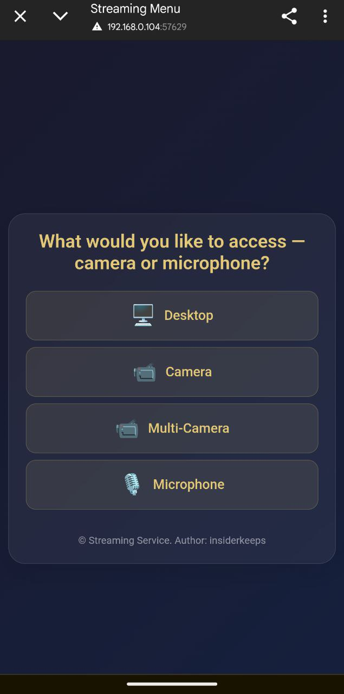
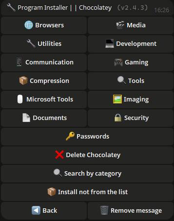

## 📝 Introducción

¡Bienvenido a **Controla tu PC con un bot de Telegram**! Este potente bot te permite controlar tu computadora de forma remota utilizando comandos sencillos de Telegram, lo que hace tu trabajo más práctico y eficiente.

El script admite tanto un solo administrador como varios administradores. Por ejemplo, si utilizas una computadora familiar, puedes dar acceso a tus seres queridos.

El script recibe actualizaciones gratuitas de forma regular. Mientras tenga la capacidad y las ganas, seguiré manteniendo su funcionalidad.

---

## 🌟 Funciones principales

<div align="center">
  <table>
   <tr>
      <td align="center">
      <br>
      <b>🔧 Navegación cómoda entre la cámara, el escritorio y el micrófono.</b><br>
      ¿Quieres activar la vigilancia o el sonido del micrófono? Tú eliges.
    </td>
    <td align="center">
      <br>
      <b>📸 Transmisión desde cámaras</b><br>
      Mira la transmisión desde tus cámaras y vigila tu hogar.
    </td>
    <td align="center">
      <br>
      <b>📸 Transmisión del escritorio</b><br>
      Observa tu escritorio desde el teléfono o desde otro PC.
    </td>
    <td align="center">
      <br>
      <b>📸 Transmisión del micrófono</b><br>
      Escucha el sonido en tiempo real desde tu micrófono, ya sea desde el teléfono o desde otro PC.
    </td>
    </tr>
    <tr>
      <td align="center">
        <br>
        <b>🌍 Localización</b><br>
        El bot está disponible en varios idiomas, proporcionando comodidad para usuarios de todo el mundo.
      </td>
      <td align="center">
        <br>
        <b>🤖 Configuración del bot</b><br>
        Cambia el token, agrega o elimina administradores directamente desde el bot.
      </td>
      <td align="center">
        <br>
        <b>🔧 Configuración del bot</b><br>
        Configura y administra fácilmente los parámetros del bot.
      </td>
    </tr>
    <tr>
      <td align="center">
        <br>
        <b>🖥️ Panel de navegación del sistema</b><br>
        Navegación conveniente con tu sistema.
      </td>
      <td align="center">
        <br>
        <b>⚙️ Información del sistema</b><br>
        Interactúa con la energía de la PC, cambia el plan de energía, bloquea la pantalla rápidamente o cierra sesión.
      </td>
      <td align="center">
        <br>
        <b>🔋 Gestión de energía</b><br>
        Administra las opciones de energía de tu PC, incluyendo apagado, reinicio, hibernación o programación de apagado.
      </td>
    </tr>
    <tr>
      <td align="center">
        <br>
        <b>🎵 Configuración de sonido</b><br>
        Configura y administra el sonido de tu PC de forma remota.
      </td>
      <td align="center">
        <br>
        <b>🖱️ Control de dispositivos</b><br>
        Controla el ratón y el teclado de forma remota.
      </td>
      <td align="center">
        <br>
        <b>🌤️ Consulta del clima</b><br>
        Obtén información actualizada del clima directamente en el bot.
      </td>
    </tr>
    <tr>
      <td align="center">
        <br>
        <b>🎥 Monitoreo de procesos</b><br>
        Agrega procesos a una lista negra para monitorearlos o revisa la actividad de nuevos procesos.
      </td>
      <td align="center">
        <br>
        <b>🗂️ Gestión de procesos</b><br>
        Visualiza y administra todos los procesos en ejecución en tu PC, revisa su consumo y ciérralos.
      </td>
      <td align="center">
        <br>
        <b>🌐 Panel de control del navegador</b><br>
        Administra acciones en el navegador sin salir del chat.
      </td>
    </tr>
    <tr>
      <td align="center">
        <br>
        <b>🔧 Instalador de programas</b><br>
        ¿Reinstalaste Windows? ¿No quieres perder tiempo buscando los programas necesarios en Internet? ¡Utiliza esta función! Aquí se encuentran diversas aplicaciones organizadas por categorías. Puedes usar la búsqueda por categorías para encontrar el programa que necesitas. Si no está en la lista, simplemente utiliza el botón «No en la lista», ingresa el nombre del paquete y el sistema te sugerirá una opción adecuada.
      </td>
      <td align="center">
        <br>
        <b>🈸 Mis aplicaciones</b><br>
        Agrega tus aplicaciones a una lista, asígnales un nombre y ejecútalas desde este menú.
      </td>
      <td align="center">
        <br>
        <b>🤡 Menú de bromas</b><br>
        ¿Quieres divertirte si alguien intenta acceder a tu PC? Reproduce un audio aleatorio, congela la pantalla o utiliza otras funciones.
      </td>
      <td align="center">
        <br>
        <b>🛠️ Preferencias</b><br>
        Configura el bot a tu gusto. ¿Quieres recibir fotos como "Documento"? Actívalo. ¿No quieres notificaciones de nuevas versiones? Desactívalas.
      </td>
    </tr>
    <tr>
      <td align="center">
        <br>
        <b>🔘 Clicker</b><br>
        Ejecuta un autoclicker para el ratón o el teclado directamente desde el bot.
      </td>
      <td align="center">
        <br>
        <b>🖼️ Captura de pantalla</b><br>
        Toma y recibe capturas de pantalla de tu PC en Telegram.
      </td>
      <td align="center">
        <br>
        <b>🖼️ Panel de funciones aterradoras</b><br>
        ¿Quieres probar algo extremo? Lanza un BSOD o cierra todos los procesos.
      </td>
    </tr>
  </table>
</div>


---

## 📂 Gestión de archivos y carpetas

- **📁 Navegar entre carpetas:** Cambia fácilmente de directorio.
- **📂 Crear carpetas:** Crea nuevas carpetas en cualquier directorio.
- **✏️ Renombrar carpetas:** Cambia fácilmente el nombre de carpetas existentes.
- **🔍 Buscar en directorios:** Encuentra archivos y carpetas en el directorio actual.
- **🔄 Cambiar de directorio:** Cambia rápidamente entre directorios.

---

## 🛠️ Utilidades adicionales

- **💻 Acceso a la línea de comandos:** Ejecuta comandos en la consola de Windows.
- **🚀 Ejecución de archivos:** Abre cualquier archivo desde tu directorio.
- **📥 Descarga de archivos:** Descarga archivos directamente a tu PC.
- **📤 Subida de archivos:** Sube archivos desde tu PC a Telegram.
- **🗑️ Eliminación de archivos y carpetas:** Elimina archivos o carpetas por nombre.
- **🔗 Descarga por enlace:** Descarga archivos mediante un enlace directo.
- **🛜 Fuerza bruta WiFi:** Descubre contraseñas de puntos de acceso seleccionados.
- **👮 Antirrobo:** Bloquea la pantalla ante cualquier actividad en el PC.
- **✍️ Escritura de texto:** Escribe texto en el PC directamente desde el bot.
- **🗣 Mensaje de voz:** Envía un mensaje de voz al bot y se reproducirá en el PC con tu voz.
- **📦 Portapapeles:** Visualiza el contenido del portapapeles y reemplázalo con nueva información.
- **🛡️ Cortafuegos:** Activa o desactiva la protección del cortafuegos directamente desde el bot.
- **🖥 Monitor:** Activa o desactiva el monitor directamente desde el bot.
- **⌨️ Bloqueo de acceso:** Bloquee el acceso al ratón y al teclado durante el tiempo que desee.
---

## 🖼️ Gestión de fondos de pantalla

- **📥 Descargar fondos de pantalla:** Guarda fondos de pantalla en tu PC.
- **🎨 Establecer fondos de pantalla:** Establece un fondo de pantalla de escritorio enviando una imagen.

---

## 💬 Enviar mensajes

- **📝 Enviar notas:** Envía mensajes a tu PC para crear notas.

## 🖥️ Sistemas Soportados

| **Sistema**      | **Compatible** | **Notas**                                                                                                                                                                     | **ENLACE**                                                                                                             |
|------------------|----------------|--------------------------------------------------------------------------------------------------------------------------------------------------------------------------------|------------------------------------------------------------------------------------------------------------------------|
| **Linux**        | ❌              |                                                                                                                                                                              |                                                                                                                        |
| **MacOS**        | ❌              |                                                                                                                                                                              |                                                                                                                        |
| **Windows 7**    | ✔️              | **Si agrega el programa al inicio, habilítelo manualmente en** `msconfig` > **Inicio.** |
| **Windows 8**    | ✔️              | 1. **Si agrega el programa al inicio, habilítelo manualmente en** `Administrador de tareas` > **Inicio.**                                                                       |                                                                                                                        |
| **Windows 10**   | ✔️              |                                                                                                                                                                              |                                                                                                                        |
| **Windows 11**   | ✔️              |                                                                                                                                                                              |                                                                                                                        |

---

## ⚠️ Información Importante
- Este script es propietario y no es de código abierto.
- Se proporcionan actualizaciones periódicas para mantener la seguridad y funcionalidad.
- ¿Qué es `update.exe`?  
  Este archivo es responsable de actualizar el script. Si desea actualizar rápidamente el script sin descargarlo manualmente, simplemente descargue y ejecute `update.exe`. Este descargará e instalará automáticamente la última versión del script.
- Nota sobre el análisis antivirus

  
  ```ini
  Algunos programas antivirus pueden marcar este archivo como un virus, ya que el programa está diseñado para controlar un PC de forma remota.
  Este es un comportamiento típico de estos programas, ya que pueden ser considerados peligrosos debido a sus funciones.
  Sin embargo, este script es completamente seguro y puede utilizarlo sin problemas.
  
  Usted decide si desea descargarlo o no, es su derecho, y respetamos su decisión. Sin embargo,
  si confía en la fuente y necesita controlar su PC de forma remota,
  simplemente agregue el archivo a la lista de archivos confiables o excluidos en su antivirus para evitar falsos positivos.
  
  El script se proporciona de forma gratuita y lo actualizaremos de vez en cuando para garantizar su seguridad,
  compatibilidad y funcionalidad mejorada.
  No se preocupe, descargar el script es seguro,
  y obtendrá una poderosa herramienta para administrar su PC de forma remota a través de TELEGRAM.

- 🚨 Descargo de responsabilidad

  - Los creadores de este script no se hacen responsables de posibles acciones ilegales de los usuarios, incluyendo el uso del programa para causar daño a otras personas. No utilice este script para realizar acciones que puedan violar leyes o los derechos de otras personas. Debe usar el programa dentro de los límites de la ley y en beneficio de usted mismo y de los demás.

---

## ⚙️ Configuración del Script

*Para configurar el script:*

1. **Ejecute el script para generar el archivo `settings.ini`, donde podrá ingresar los datos (se muestra un ejemplo a continuación).**
2. **Alternativamente, cree un archivo llamado `settings.ini`, copie el ejemplo a continuación, péguelo en el archivo y luego reemplácelo con SUS datos.**

    ```ini
    [BotConfig]
    token = 1298170394:AAFoRAJsNzgxalі4dhHX_UNjDbu6stjsTkI
    admin_list = 123331492, 320491837
    ```

### Dónde Obtener los Datos Requeridos

1. **Token del Bot:**  
   - Vaya a Telegram y busque [@BotFather](https://t.me/BotFather).  
   - Inicie un chat con él y envíe el comando `/newbot`.  
   - Siga las instrucciones para crear un nuevo bot y obtener su token único.  
     Ejemplo: `123456789:ABCDefghIJKLMNOPQRSTUVWXYZ`.  
   - Guarde este token para usarlo en el archivo `settings.ini`.

2. **ID(s) del Administrador:**  
   - Abra Telegram y busque `MYID` y `getmyid`.  
   - Inicie un chat con él, y mostrará su ID de usuario única de Telegram.  
     Ejemplo: `123456789`.  
   - Agregue su ID a la `admin_list` en el archivo `settings.ini` para asegurarse de que tiene acceso a los comandos de administrador.
   - Si desea agregar varios administradores, separe sus IDs con una coma (`,`) como se muestra arriba.

