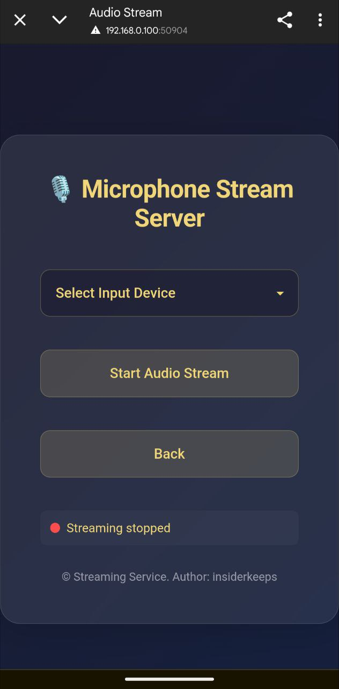

## 📝 Introducción

¡Bienvenido a **PCGuardControl**! Esta potente herramienta te permite controlar tu ordenador de forma remota a través de sencillos comandos en Telegram, haciendo tu trabajo más cómodo y eficiente.

El script es compatible con uno o varios administradores. Por ejemplo, en un ordenador familiar, puedes dar acceso a tus seres queridos.

Lanzamos actualizaciones gratuitas regularmente para mantener la funcionalidad y seguridad del script.

---

## 🌟 Características principales

<div align="center">
  <table>
    <tr>
      <td align="center">
        <br>
        <b>🔧 Navegación cómoda</b><br>
        Cambia fácilmente entre el control de la cámara, el escritorio y el micrófono.
      </td>
      <td align="center">
        <br>
        <b>📸 Videovigilancia</b><br>
        Transmite video desde las cámaras para vigilar tu casa.
      </td>
      <td align="center">
        <br>
        <b>📸 Transmisión de pantalla</b><br>
        Supervisa el escritorio desde tu teléfono u otro dispositivo.
      </td>
      <td align="center">
        <br>
        <b>📸 Transmisión de audio</b><br>
        Escucha el audio del micrófono en tiempo real.
      </td>
    </tr>
    <tr>
      <td align="center">
        <br>
        <b>🌍 Soporte de idiomas</b><br>
        El bot está disponible en varios idiomas para la comodidad de los usuarios de todo el mundo.
      </td>
      <td align="center">
        <br>
        <b>🤖 Configuración del bot</b><br>
        Cambia el token, añade o elimina administradores directamente en el bot.
      </td>
      <td align="center">
        <br>
        <b>🔧 Gestión de ajustes</b><br>
        Configura los parámetros del bot de forma rápida y sencilla.
      </td>
    </tr>
    <tr>
      <td align="center">
        <br>
        <b>🖥️ Gestión del sistema</b><br>
        Una interfaz cómoda para interactuar con el sistema.
      </td>
      <td align="center">
        <br>
        <b>⚙️ Información del sistema</b><br>
        Gestiona la energía, los planes de energía, el bloqueo de pantalla o el cierre de sesión.
      </td>
      <td align="center">
        <br>
        <b>🔋 Gestión de energía</b><br>
        Apaga, reinicia, pon el PC en modo de suspensión o programa el apagado.
      </td>
    </tr>
    <tr>
      <td align="center">
        <br>
        <b>🎵 Ajuste de sonido</b><br>
        Regula el sonido del PC de forma remota.
      </td>
      <td align="center">
        <br>
        <b>🖱️ Control de dispositivos</b><br>
        Controla el ratón y el teclado de forma remota.
      </td>
      <td align="center">
        <br>
        <b>🌤️ Tiempo</b><br>
        Recibe datos meteorológicos actualizados directamente en el bot.
      </td>
    </tr>
    <tr>
      <td align="center">
        <br>
        <b>🎥 Monitoreo de procesos</b><br>
        Rastrea los procesos, añadiéndolos a una lista negra, y controla los nuevos lanzamientos.
      </td>
      <td align="center">
        <br>
        <b>🗂️ Gestión de procesos</b><br>
        Visualiza los procesos en ejecución, sus recursos y finalízalos si es necesario.
      </td>
      <td align="center">
        <br>
        <b>🌐 Control del navegador</b><br>
        Realiza acciones en el navegador directamente desde el chat.
      </td>
    </tr>
    <tr>
      <td align="center">
        <br>
        <b>🔧 Instalación de programas</b><br>
        ¿Reinstalaste Windows? Encuentra los programas necesarios por categorías o mediante búsqueda. Si un programa no está en la lista, introduce su nombre para instalarlo.
      </td>
      <td align="center">
        <br>
        <b>🈸 Mis aplicaciones</b><br>
        Añade aplicaciones a la lista, asígnales nombres y ejecútalas desde el menú.
      </td>
      <td align="center">
        <br>
        <b>🤡 Funciones de broma</b><br>
        Gástale una broma a quien intente usar tu PC: reproduce un audio aleatorio, una melodía o bloquea la pantalla.
      </td>
      <td align="center">
        <br>
        <b>🛠️ Personalización</b><br>
        Configura el bot: formato de imágenes, notificaciones de versiones, bloqueo de pantalla, etc.
      </td>
    </tr>
    <tr>
      <td align="center">
        <br>
        <b>🔘 Autoclicker</b><br>
        Inicia un autoclicker para el ratón o el teclado directamente desde el bot.
      </td>
      <td align="center">
        <br>
        <b>🖼️ Capturas de pantalla</b><br>
        Haz y recibe capturas de pantalla de tu PC en Telegram.
      </td>
      <td align="center">
        <br>
        <b>🖼️ Funciones extremas</b><br>
        ¡Ponte a prueba: provoca un BSOD o finaliza todos los procesos!
      </td>
    </tr>
  </table>
</div>

---

## 📂 Gestión de archivos y carpetas

- **📁 Navegación por carpetas:** Cambia rápidamente entre directorios.
- **📂 Creación de carpetas:** Crea nuevas carpetas en cualquier lugar.
- **✏️ Renombrar:** Cambia los nombres de las carpetas existentes.
- **🔍 Escaneo:** Visualiza los archivos y carpetas en el directorio actual.
- **🔄 Cambio de directorio:** Muévete fácilmente entre carpetas.

---

## 🛠️ Funciones adicionales

- **💻 Línea de comandos:** Ejecuta comandos en la consola de Windows.
- **🚀 Ejecutar archivos:** Abre archivos desde cualquier directorio.
- **📥 Cargar archivos:** Envía archivos al PC.
- **📤 Descargar archivos:** Recibe archivos del PC en Telegram.
- **🗑️ Eliminar:** Borra archivos o carpetas por su nombre.
- **🔗 Descarga por enlace:** Descarga archivos desde enlaces directos.
- **👮 Antirrobo:** Bloquea la pantalla ante cualquier actividad.
- **✍️ Introducción de texto:** Escribe texto en el PC a través del bot.
- **🗣 Mensajes de voz:** Envía mensajes de voz que se reproducirán en el PC.
- **📦 Portapapeles:** Visualiza y modifica el contenido del portapapeles.
- **🛡️ Firewall:** Activa/desactiva la protección directamente en el bot.
- **🖥 Control del monitor:** Enciende/apaga el monitor.
- **⌨️ Bloqueo de entrada:** Restringe el acceso al ratón y al teclado.
- **🪫 Control de batería:** Recibe notificaciones sobre el bajo nivel de batería del portátil.
- **🗂 Reiniciar explorador:** Reinicia el explorador de Windows.

---

## 🖼️ Gestión de fondos de pantalla

- **📥 Cargar fondos de pantalla:** Guarda imágenes en el PC.
- **🎨 Establecer fondo de pantalla:** Cambia el fondo de escritorio enviando una imagen.

---

## 💬 Notificaciones

- **📝 Enviar notificaciones:** Crea notas y notificaciones del sistema en el PC.

---

## 🖥️ Sistemas compatibles

| **Sistema**      | **Soporte** | **Notas**                                                                                        | **Enlace** |
|------------------|-------------|--------------------------------------------------------------------------------------------------|------------|
| **Linux**        | ❌          |                                                                                                  |            |
| **MacOS**        | ❌          |                                                                                                  |            |
| **Windows 7**    | ✔️          | Para el inicio automático, activa el programa en `msconfig` > **Inicio de Windows**.             |            |
| **Windows 8**    | ✔️          | Para el inicio automático, activa el programa en `Administrador de tareas` > **Inicio**.         |            |
| **Windows 10**   | ✔️          |                                                                                                  |            |
| **Windows 11**   | ✔️          |                                                                                                  |            |

---

## ⚠️ Información importante

- El script es propietario y no tiene código fuente abierto.
- Las actualizaciones regulares garantizan la seguridad y nuevas funcionalidades.
- **¿Qué es `update.exe`?**  
  Es un archivo para la actualización automática del script. Ejecútalo para descargar la última versión sin instalación manual.
- **⚠️ No uses el mismo token en varios programas simultáneamente** — solo en una aplicación.
- **Sobre las alertas de antivirus:**

  ```ini
  Algunos antivirus pueden marcar el script como una amenaza, ya que está diseñado para el control remoto del PC.
  Este es un comportamiento normal para programas de este tipo debido a su funcionalidad.
  El script es completamente seguro de usar.

  Decide por ti mismo si descargarlo o no — es tu derecho y lo respetamos. Si confías en la fuente,
  añade el archivo a las exclusiones del antivirus para evitar falsos positivos.

  El script se proporciona de forma gratuita y lo actualizaremos para garantizar la seguridad y la funcionalidad.
  ¡La descarga es segura y obtendrás una potente herramienta para gestionar tu PC a través de Telegram!
  ```

- **🚨 Descargo de responsabilidad:**  
  Los desarrolladores no se hacen responsables del uso ilegal del script. No lo utilices para acciones que infrinjan la ley o los derechos de otras personas. Usa el programa solo para fines legales.

---

## ⚙️ Configuración del script

Para la configuración:

1. Ejecuta el script para crear el archivo `settings.ini` para introducir los datos (ejemplo a continuación).
2. O crea el archivo `settings.ini`, copia el ejemplo y reemplaza los datos con los tuyos.

    ```ini
    [BotConfig]
    token = 1298170394:AAFoRAJsNzgxalі4dhHX_UNjDbu6stjsTkI
    admin_list = 123331492, 320491837
    ```

### Cómo obtener los datos

1. **Token del bot:**  
   - Busca en Telegram a [@BotFather](https://t.me/BotFather).  
   - Envía el comando `/newbot` y sigue las instrucciones para crear un bot.  
   - Recibirás un token, por ejemplo: `123456789:ABCDefghIJKLMNOPQRSTUVWXYZ`.  
   - Guárdalo en `settings.ini`.

2. **ID de administrador:**  
   - Busca en Telegram a `@userinfobot` o `@getmyid_bot`.  
   - Inicia un chat para obtener tu ID de Telegram, por ejemplo: `123456789`.  
   - Añade el ID a `admin_list` en `settings.ini`. Para varios administradores, separa los IDs con comas (`,`).