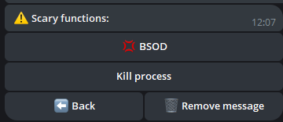

## 📝 Introduction

Bienvenue dans **PCGuardControl** ! Cet outil puissant vous permet de gérer votre ordinateur à distance via des commandes simples sur Telegram, rendant votre travail plus pratique et efficace.

Le script prend en charge un ou plusieurs administrateurs. Par exemple, sur un ordinateur familial, vous pouvez accorder l’accès à vos proches.

Des mises à jour gratuites sont régulièrement publiées pour maintenir la sécurité et la fonctionnalité du script.

---

## 🌟 Fonctionnalités principales

<div align="center">
  <table>
    <tr>
      <td align="center">
        <br>
        <b>🔧 Navigation intuitive</b><br>
        Basculez facilement entre la gestion de la caméra, du bureau et du micro.
      </td>
      <td align="center">
        <br>
        <b>📸 Vidéosurveillance</b><br>
        Diffusez des vidéos depuis vos caméras pour surveiller votre maison.
      </td>
      <td align="center">
        <br>
        <b>📸 Diffusion d’écran</b><br>
        Suivez votre bureau depuis un téléphone ou un autre appareil.
      </td>
      <td align="center">
        <br>
        <b>📸 Diffusion audio</b><br>
        Écoutez le son de votre micro en temps réel.
      </td>
    </tr>
    <tr>
      <td align="center">
        <br>
        <b>🌍 Prise en charge multilingue</b><br>
        Le bot est disponible dans plusieurs langues pour une utilisation mondiale.
      </td>
      <td align="center">
        <br>
        <b>🤖 Configuration du bot</b><br>
        Modifiez le token, ajoutez ou supprimez des administrateurs directement via le bot.
      </td>
      <td align="center">
        <br>
        <b>🔧 Gestion des paramètres</b><br>
        Configurez les paramètres du bot rapidement et facilement.
      </td>
    </tr>
    <tr>
      <td align="center">
        <br>
        <b>🖥️ Gestion du système</b><br>
        Interface pratique pour interagir avec votre système.
      </td>
      <td align="center">
        <br>
        <b>⚙️ Informations système</b><br>
        Gérez l’alimentation, les plans d’alimentation, le verrouillage de l’écran ou la déconnexion.
      </td>
      <td align="center">
        <br>
        <b>🔋 Gestion de l’alimentation</b><br>
        Éteignez, redémarrez, mettez en veille ou planifiez l’arrêt de votre PC.
      </td>
    </tr>
    <tr>
      <td align="center">
        <br>
        <b>🎵 Paramètres audio</b><br>
        Ajustez le son de votre PC à distance.
      </td>
      <td align="center">
        <br>
        <b>🖱️ Contrôle des périphériques</b><br>
        Contrôlez la souris et le clavier à distance.
      </td>
      <td align="center">
        <br>
        <b>🌤️ Météo</b><br>
        Obtenez des informations météo actualisées directement dans le bot.
      </td>
    </tr>
    <tr>
      <td align="center">
        <br>
        <b>🎥 Surveillance des processus</b><br>
        Suivez les processus en les ajoutant à une liste noire et surveillez les nouveaux lancements.
      </td>
      <td align="center">
        <br>
        <b>🗂️ Gestion des processus</b><br>
        Consultez les processus en cours, leurs ressources et mettez-les fin si nécessaire.
      </td>
      <td align="center">
        <br>
        <b>🌐 Contrôle du navigateur</b><br>
        Effectuez des actions dans le navigateur directement depuis le chat.
      </td>
    </tr>
    <tr>
      <td align="center">
        <br>
        <b>🔧 Installation de programmes</b><br>
        Windows réinstallé ? Trouvez des programmes par catégorie ou recherche. Si un programme n’est pas listé, entrez son nom pour l’installer.
      </td>
      <td align="center">
        <br>
        <b>🈸 Mes applications</b><br>
        Ajoutez vos applications à une liste, donnez-leur un nom et lancez-les depuis ce menu.
      </td>
      <td align="center">
        <br>
        <b>🤡 Fonctions amusantes</b><br>
        Amusez-vous en piégeant ceux qui utilisent votre PC : jouez un son aléatoire, une mélodie ou bloquez l’écran.
      </td>
      <td align="center">
        <br>
        <b>🛠️ Personnalisation</b><br>
        Personnalisez le bot : format des images, notifications de mise à jour, verrouillage d’écran, etc.
      </td>
    </tr>
    <tr>
      <td align="center">
        <br>
        <b>🔘 Autoclicker</b><br>
        Lancez un autoclicker pour la souris ou le clavier directement depuis le bot.
      </td>
      <td align="center">
        <br>
        <b>🖼️ Captures d’écran</b><br>
        Prenez et recevez des captures d’écran de votre PC sur Telegram.
      </td>
      <td align="center">
        <br>
        <b>🖼️ Fonctions extrêmes</b><br>
        Testez vos limites : déclenchez un BSOD ou fermez tous les processus !
      </td>
    </tr>
  </table>
</div>

---

## 📂 Gestion des fichiers et dossiers

- **📁 Navigation dans les dossiers :** Passez rapidement d’un répertoire à l’autre.
- **📂 Création de dossiers :** Créez de nouveaux dossiers n’importe où.
- **✏️ Renommage :** Modifiez les noms des dossiers existants.
- **🔍 Analyse :** Consultez les fichiers et dossiers du répertoire actuel.
- **🔄 Changement de répertoire :** Naviguez facilement entre les dossiers.

---

## 🛠️ Fonctions supplémentaires

- **💻 Ligne de commande :** Exécutez des commandes dans la console Windows.
- **🚀 Lancement de fichiers :** Ouvrez des fichiers depuis n’importe quel répertoire.
- **📥 Téléchargement de fichiers :** Envoyez des fichiers sur votre PC.
- **📤 Téléversement de fichiers :** Récupérez des fichiers depuis votre PC sur Telegram.
- **🗑️ Suppression :** Supprimez des fichiers ou dossiers par leur nom.
- **🔗 Téléchargement par lien :** Téléchargez des fichiers via des liens directs.
- **👮 Antivol :** Verrouillez l’écran en cas d’activité sur le PC.
- **✍️ Saisie de texte :** Tapez du texte sur votre PC via le bot.
- **🗣 Messages vocaux :** Envoyez des messages vocaux qui seront lus sur le PC.
- **📦 Presse-papiers :** Consultez et modifiez le contenu du presse-papiers.
- **🛡️ Pare-feu :** Activez/désactivez la protection directement dans le bot.
- **🖥 Gestion de l’écran :** Allumez/éteignez l’écran.
- **⌨️ Verrouillage des entrées :** Limitez l’accès à la souris et au clavier.
- **🪫 Suivi de la batterie :** Recevez des notifications pour une batterie faible.
- **🗂 Redémarrage de l’Explorateur :** Redémarrez l’Explorateur Windows.

---

## 🖼️ Gestion des fonds d’écran

- **📥 Téléchargement de fonds d’écran :** Enregistrez des images sur votre PC.
- **🎨 Définition des fonds d’écran :** Changez le fond d’écran en envoyant une image.

---

## 💬 Notifications

- **📝 Envoi de notifications :** Créez des notes et des notifications système sur votre PC.

---

## 🖥️ Systèmes pris en charge

| **Système**      | **Support** | **Remarques**                                                                                   | **Lien** |
|------------------|-------------|-------------------------------------------------------------------------------------------------|----------|
| **Linux**        | ❌          |                                                                                                 |          |
| **MacOS**        | ❌          |                                                                                                 |          |
| **Windows 7**    | ✔️          | Activez manuellement le programme dans `msconfig` > **Démarrage**.                              |          |
| **Windows 8**    | ✔️          | Activez manuellement le programme dans `Gestionnaire des tâches` > **Démarrage**.               |          |
| **Windows 10**   | ✔️          |                                                                                                 |          |
| **Windows 11**   | ✔️          |                                                                                                 |          |

---

## ⚠️ Informations importantes

- Le script est propriétaire et non open-source.
- Des mises à jour régulières garantissent sécurité et nouvelles fonctionnalités.
- **Qu’est-ce que `update.exe` ?**  
  Ce fichier permet la mise à jour automatique du script. Lancez-le pour télécharger la dernière version sans installation manuelle.
- **⚠️ N’utilisez pas le même token dans plusieurs programmes simultanément** — uniquement dans une seule application.
- **À propos des détections antivirus :**

  ```ini
  Certains antivirus peuvent signaler le script comme une menace en raison de sa fonction de contrôle à distance.
  C’est un comportement courant pour ce type de programmes en raison de leurs fonctionnalités.
  Le script est totalement sûr à utiliser.

  Vous décidez de le télécharger ou non — c’est votre droit, et nous le respectons. Si vous faites confiance à la source,
  ajoutez le fichier aux exclusions de votre antivirus pour éviter les faux positifs.

  Le script est fourni gratuitement, et nous le mettrons à jour pour garantir sécurité et fonctionnalité.
  Le téléchargement est sûr, et vous obtiendrez un outil puissant pour gérer votre PC via Telegram !
  ```

- **🚨 Avertissement :**  
  Les développeurs ne sont pas responsables de l’utilisation illégale du script. Ne l’utilisez pas pour des actions violant la loi ou les droits d’autrui. Utilisez le programme uniquement à des fins légales.

---

## ⚙️ Configuration du script

Pour configurer :

1. Lancez le script pour générer le fichier `settings.ini` où entrer les données (exemple ci-dessous).
2. Ou créez un fichier `settings.ini`, copiez l’exemple et remplacez par vos données.

    ```ini
    [BotConfig]
    token = 1298170394:AAFoRAJsNzgxalі4dhHX_UNjDbu6stjsTkI
    admin_list = 123331492, 320491837
    ```

### Comment obtenir les données

1. **Token du bot :**  
   - Trouvez [@BotFather](https://t.me/BotFather) sur Telegram.  
   - Envoyez la commande `/newbot` et suivez les instructions pour créer un bot.  
   - Obtenez le token, par exemple : `123456789:ABCDefghIJKLMNOPQRSTUVWXYZ`.  
   - Enregistrez-le dans `settings.ini`.

2. **ID administrateur :**  
   - Trouvez `@userinfobot` ou `@getmyid_bot` sur Telegram.  
   - Lancez un chat pour obtenir votre ID Telegram, par exemple : `123456789`.  
   - Ajoutez l’ID à `admin_list` dans `settings.ini`. Pour plusieurs administrateurs, séparez les ID par des virgules (`,`).