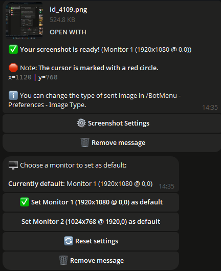

## 📝 Introduction

Bienvenue dans **Contrôlez votre PC avec un bot Telegram** ! Ce puissant bot vous permet de contrôler votre ordinateur à distance en utilisant des commandes Telegram simples, ce qui rend votre travail plus pratique et efficace.

Le script prend en charge un administrateur unique ainsi que plusieurs administrateurs. Par exemple, si vous utilisez un ordinateur familial, vous pouvez donner l'accès à vos proches.

Le script reçoit régulièrement des mises à jour gratuites. Tant que j'ai la capacité et l'envie, je maintiendrai sa fonctionnalité.
---

## 🌟 Fonctionnalités principales

<div align="center">
  <table>
    <tr>
      <td align="center">
        <br>
        <b>🌍 Localisation</b><br>
        Le bot est disponible en plusieurs langues, ce qui le rend pratique pour les utilisateurs du monde entier.
      </td>
      <td align="center">
        <br>
        <b>🖼️ Capture d'écran</b><br>
        Prenez et recevez des captures d'écran directement depuis votre PC.
      </td>
      <td align="center">
        <br>
        <b>🔧 Configuration du bot</b><br>
        Configurez et gérez facilement les paramètres du bot.
      </td>
    </tr>
    <tr>
      <td align="center">
        <br>
        <b>🖥️ Panneau de contrôle du système</b><br>
        Surveillez et contrôlez les processus de votre système.
      </td>
      <td align="center">
        <br>
        <b>⚙️ Informations système</b><br>
        Consultez des informations détaillées sur le système, telles que la charge du processeur, les statistiques de la mémoire et bien plus encore.
      </td>
      <td align="center">
        <br>
        <b>🔋 Gestion de l'alimentation</b><br>
        Contrôlez les paramètres d'alimentation de votre PC, y compris l'arrêt, le redémarrage et le mode veille.
      </td>
    </tr>
  </table>
</div>

## ❓ Vidéo de démonstration > [Cliquez ici](https://vimeo.com/1013143950)

---

## 📂 Gestion des fichiers et dossiers

- **📁 Déplacer entre les dossiers :** Changez facilement de répertoire.
- **📂 Créer des dossiers :** Créez de nouveaux dossiers dans n'importe quel répertoire.
- **✏️ Renommer les dossiers :** Renommez facilement les dossiers existants.
- **🔍 Scanner les répertoires :** Trouvez des fichiers et des dossiers dans le répertoire actuel.
- **🔄 Changer de répertoire :** Passez rapidement d'un répertoire à un autre.

---

## 🛠️ Utilitaires supplémentaires

- **💻 Accès à la ligne de commande :** Exécutez des commandes dans la console Windows.
- **🚀 Exécuter des fichiers :** Ouvrez n'importe quel fichier depuis votre répertoire.
- **📥 Télécharger des fichiers :** Téléchargez des fichiers directement sur votre PC.
- **📤 Télécharger des fichiers :** Téléchargez des fichiers depuis votre PC vers Telegram.
- **🗑️ Supprimer des fichiers et des dossiers :** Supprimez des fichiers ou des dossiers par nom.
- **🔗 Télécharger depuis un lien :** Téléchargez des fichiers depuis un lien direct.

---

## 🖼️ Gestion des fonds d'écran

- **📥 Télécharger des fonds d'écran :** Sauvegardez des fonds d'écran sur votre PC.
- **🎨 Définir un fond d'écran :** Définissez un fond d'écran en envoyant une image.

---

## 💬 Envoi de messages

- **📝 Envoyer des notes :** Envoyez des messages sur votre PC pour créer des notes.

## 🖥️ Systèmes Pris en Charge

| **Système**      | **Compatible** | **Notes**                                                                                                                                                                     | **LIEN**                                                                                                               |
|------------------|----------------|--------------------------------------------------------------------------------------------------------------------------------------------------------------------------------|------------------------------------------------------------------------------------------------------------------------|
| **Linux**        | ❌              |                                                                                                                                                                              |                                                                                                                        |
| **MacOS**        | ❌              |                                                                                                                                                                              |                                                                                                                        |
| **Windows 7**    | ✔️              | 1. **Vous pouvez rencontrer une erreur :** `api-ms-win-core-path-l1-1-0.dll`. **Téléchargez le fichier nécessaire pour résoudre cela.**<br>2. **Si vous ajoutez le programme au démarrage, activez-le manuellement dans** `msconfig` > **Démarrage.** | [Allez au lien](https://github.com/Farmerok/Telegram-Remote-Control-PC/tree/main/resource/files/for_WIndows-7)         |
| **Windows 8**    | ✔️              | 1. **Si vous ajoutez le programme au démarrage, activez-le manuellement dans** `Gestionnaire de tâches` > **Démarrage.**                                                         |                                                                                                                        |
| **Windows 10**   | ✔️              |                                                                                                                                                                              |                                                                                                                        |
| **Windows 11**   | ✔️              |                                                                                                                                                                              |                                                                                                                        |

---

## ⚠️ Informations Importantes
- Ce script est propriétaire et non open-source.
- Des mises à jour régulières sont fournies pour maintenir la sécurité et la fonctionnalité.
- Qu'est-ce que `update.exe` ?  
  Ce fichier est responsable de la mise à jour du script. Si vous souhaitez mettre à jour rapidement le script sans le télécharger manuellement, il vous suffit de télécharger et d'exécuter `update.exe`. Il téléchargera et installera automatiquement la dernière version du script.
- Remarque concernant l'analyse antivirus

  
  ```ini
  Certains programmes antivirus peuvent signaler ce fichier comme un virus, car le programme est conçu pour contrôler un PC à distance.
  C'est un comportement typique de ces programmes, car ils peuvent être considérés comme potentiellement dangereux en raison de leurs fonctions.
  Cependant, ce script est absolument sûr et vous pouvez l'utiliser sans problème.
  
  Vous décidez si vous souhaitez le télécharger ou non - c'est votre droit, et nous respectons votre décision. Cependant,
  si vous faites confiance à la source et avez besoin de contrôler votre PC à distance,
  ajoutez simplement le fichier à la liste des fichiers de confiance ou exclus dans votre antivirus pour éviter les faux positifs.
  
  Le script est fourni gratuitement et nous le mettrons à jour de temps en temps pour garantir sa sécurité,
  sa compatibilité et améliorer sa fonctionnalité.
  Ne vous inquiétez pas, télécharger le script est sûr,
  et vous obtiendrez un outil puissant pour gérer votre PC à distance via TELEGRAM !

- 🚨 Avertissement

  - Les créateurs de ce script ne sont pas responsables des éventuelles actions illégales des utilisateurs, y compris l'utilisation du programme pour nuire à d'autres personnes. N'utilisez pas ce script pour effectuer des actions qui pourraient violer des lois ou les droits d'autrui. Vous devez utiliser le programme dans les limites de la loi et pour le bien de vous-même et des autres.

---

## ⚙️ Configuration du Script

*Pour configurer le script :*

1. **Exécutez le script pour générer le fichier `settings.ini`, où vous pourrez entrer les données (un exemple est montré ci-dessous).**
2. **Alternativement, créez un fichier nommé `settings.ini`, copiez l'exemple ci-dessous, collez-le dans le fichier, puis remplacez-le par VOS données.**

    ```ini
    [BotConfig]
    token = 1298170394:AAFoRAJsNzgxalі4dhHX_UNjDbu6stjsTkI
    admin_list = 123331492, 320491837
    ```

### Où Obtenir les Données Nécessaires

1. **Token du Bot :**  
   - Allez sur Telegram et recherchez [@BotFather](https://t.me/BotFather).  
   - Lancez une conversation avec lui et envoyez la commande `/newbot`.  
   - Suivez les instructions pour créer un nouveau bot et obtenir votre token unique.  
     Exemple : `123456789:ABCDefghIJKLMNOPQRSTUVWXYZ`.  
   - Conservez ce token pour l'utiliser dans le fichier `settings.ini`.

2. **ID(s) de l'Administrateur :**  
   - Ouvrez Telegram et recherchez `MYID` et `getmyid`.  
   - Lancez une conversation avec lui, et il affichera votre ID utilisateur unique Telegram.  
     Exemple : `123456789`.  
   - Ajoutez votre ID à la `admin_list` dans le fichier `settings.ini` pour vous assurer que vous avez accès aux commandes administratives.
   - Si vous souhaitez ajouter plusieurs administrateurs, séparez leurs IDs par une virgule (`,`) comme montré ci-dessus.
