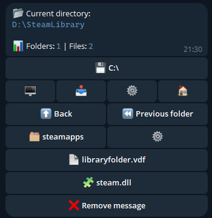
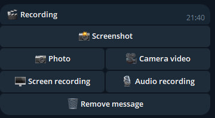

# PCGuardControl

## 📝 Introduzione

Benvenuto in **PCGuardControl** — uno strumento per controllare da remoto il tuo computer Windows tramite Telegram.

Il bot ti consente di eseguire azioni quotidiane sul tuo PC direttamente dalla chat: gestire alimentazione e audio, lavorare con file e applicazioni, ottenere screenshot, controllare i processi, usare un mouse e una tastiera remoti, avviare lo streaming dello schermo e della fotocamera e molto altro.

Sono supportati **uno o più amministratori**. Ad esempio, puoi concedere l'accesso a più utenti fidati sullo stesso computer.

Il progetto riceve aggiornamenti con correzioni, miglioramenti e nuove funzionalità.

---

## 🌟 Funzionalità principali

<div align="center">
  <table>
    <tr>
      <td align="center">
        <br>
        <b>🔧 Navigazione comoda</b><br>
        Le funzioni principali sono organizzate in sezioni chiare: sistema, streaming, processi, multimedia, applicazioni, plugin e altri strumenti.
      </td>
      <td align="center">
        <br>
        <b>📸 Fotocamera</b><br>
        Ottieni immagini dalle fotocamere collegate e usa la videosorveglianza tramite Telegram.
      </td>
      <td align="center">
        <br>
        <b>🖥️ Streaming in diretta</b><br>
        Guarda il desktop in tempo reale, scegli il monitor, gli FPS, la qualità e la scala. È supportato uno streaming audio separato.
      </td>
    </tr>
    <tr>
      <td align="center">
        <br>
        <b>🌍 8 lingue dell'interfaccia</b><br>
        Inglese, ucraino, russo, spagnolo, italiano, francese, tedesco e arabo.
      </td>
      <td align="center">
        <br>
        <b>🤖 Configurazione del bot</b><br>
        Gestisci amministratori, token, proxy, utenti e la posizione della configurazione. Per ogni amministratore è possibile configurare separatamente l'accesso alle funzioni e alle sezioni del bot.
      </td>
      <td align="center">
        <br>
        <b>⚙️ Pannello del bot</b><br>
        Riavvio, esecuzione con diritti di amministratore, avvio automatico, notifiche, lingua, aggiornamenti, prestazioni, reset della configurazione e altre impostazioni.
      </td>
    </tr>
    <tr>
      <td align="center">
        <br>
        <b>🧰 Pannello di sistema</b><br>
        Accesso rapido al sistema, alle funzioni pericolose, alla pulizia, all'installatore di programmi, alle applicazioni, allo streaming in diretta, ai processi, ai media, ai moduli e ai plugin.
      </td>
      <td align="center">
        <br>
        <b>🖥️ Controllo di Windows</b><br>
        Alimentazione, blocco schermo, disconnessione, rete, Wi-Fi, riavvio di Esplora file, luminosità, batteria, protezione antifurto e sensore di movimento.
      </td>
      <td align="center">
        <br>
        <b>🔋 Gestione dell'alimentazione</b><br>
        Spegni, riavvia o metti in ibernazione il PC immediatamente o tramite timer. Sono disponibili l'inserimento manuale dell'orario e l'annullamento di un'azione pianificata.
      </td>
    </tr>
    <tr>
      <td align="center">
        <br>
        <b>🎵 Controllo multimediale</b><br>
        Controlla la riproduzione e il volume: pausa/ripresa, traccia precedente/successiva, silenziamento e regolazione del livello del volume.
      </td>
      <td align="center">
        <br>
        <b>🖱️ Tastiera, mouse e appunti</b><br>
        Controlla il mouse e la tastiera, inserisci testo, invia combinazioni di tasti e lavora con gli appunti.
      </td>
      <td align="center">
        <br>
        <b>🖼️ Screenshot</b><br>
        Cattura un'immagine di un monitor o di tutti, attiva la visualizzazione del cursore, scegli il formato dell'immagine, la dimensione e il monitor predefinito.
      </td>
    </tr>
    <tr>
      <td align="center">
        <br>
        <b>📊 Monitoraggio dei processi</b><br>
        Tieni traccia dell'avvio delle applicazioni, usa una lista nera e ricevi notifiche sui processi rilevati o sconosciuti.
      </td>
      <td align="center">
        <br>
        <b>🗂️ Gestione processi</b><br>
        Visualizza i processi in esecuzione, il PID, il carico, le relazioni padre/figlio, usa la ricerca e termina il processo selezionato.
      </td>
      <td align="center">
        <br>
        <b>🌐 Controllo del browser</b><br>
        Cambia pagina, aggiorna una scheda, esegui una ricerca, apri nuove schede, scorri la pagina e chiudi le schede o il browser.
      </td>
    </tr>
    <tr>
      <td align="center">
        <br>
        <b>🔧 Installazione dei programmi</b><br>
        Installa applicazioni tramite Chocolatey: scegli le categorie, usa la ricerca, l'installazione multipla, aggiorna i pacchetti obsoleti o inserisci manualmente il nome del programma.
      </td>
      <td align="center">
        <br>
        <b>🈸 Le mie applicazioni</b><br>
        Aggiungi i tuoi programmi con un nome e un percorso del file, quindi avviali, modificali o rimuovili dall'elenco.
      </td>
      <td align="center">
        <br>
        <b>📂 Gestione file</b><br>
        Visualizza la directory corrente e il numero di cartelle e file, naviga tra unità e cartelle, torna indietro e gestisci i file direttamente da Telegram.
      </td>
    </tr>
    <tr>
      <td align="center">
        <br>
        <b>🔘 Autoclicker</b><br>
        Avvia clic automatici del mouse o della tastiera e mettili in pausa direttamente da Telegram.
      </td>
      <td align="center">
        <br>
        <b>🤡 Menu scherzoso</b><br>
        Segnale acustico, avvisi di sistema, movimento caotico del mouse, blocco dello schermo, riproduzione audio, sintesi vocale del testo e scuotimento della finestra attiva.
      </td>
      <td align="center">
        <br>
        <b>⚠️ Funzioni pericolose</b><br>
        Una sezione separata per azioni a rischio maggiore, incluso l'avvio di un BSOD e la chiusura forzata di un processo.
      </td>
    </tr>
    <tr>
      <td align="center">
        <br>
        <b>🎬 Registrazione</b><br>
        Scatta screenshot e foto con la fotocamera, registra video dalla webcam, di uno o tutti i monitor e l'audio da un microfono selezionato. Per la registrazione è possibile scegliere dispositivo, monitor e durata.
      </td>
    </tr>
  </table>
</div>

---

## 📂 Gestione di file e cartelle

PCGuardControl consente di lavorare con il file system del computer senza accesso diretto al desktop.

- **📁 Navigazione tra cartelle** — spostati tra le directory e visualizzane il contenuto.
- **📂 Creazione di cartelle** — crea nuove directory nella posizione scelta.
- **✏️ Rinomina** — cambia i nomi di file e cartelle.
- **🔍 Visualizzazione del contenuto** — ottieni un elenco di file e cartelle della directory corrente.
- **📥 Caricamento sul PC** — invia file da Telegram al computer.
- **📤 Download dal PC** — ottieni i file necessari dal computer verso Telegram.
- **🚀 Esecuzione di file** — apri file e programmi dalla directory selezionata.
- **🗑️ Eliminazione** — elimina i file e le cartelle selezionati.
- **🔗 Download tramite link** — scarica file sul PC tramite un link diretto.

---

## 🛠️ Funzionalità aggiuntive

- **💻 Console** — esegui comandi Windows da remoto.
- **✍️ Inserimento di testo** — digita testo sul computer tramite Telegram.
- **⌨️ Combinazioni di tasti** — invia combinazioni di tasti personalizzate.
- **📦 Appunti** — visualizza e modifica il contenuto degli appunti.
- **👀 Monitoraggio degli appunti** — ricevi notifiche quando cambiano.
- **🗣️ Messaggi vocali** — invia audio da riprodurre sul computer.
- **🛡️ Firewall** — gestisci lo stato del firewall di Windows dal bot.
- **🖥️ Controllo del monitor** — accendi o spegni il monitor.
- **⌨️ Blocco dell'input** — limita il funzionamento di mouse e tastiera.
- **🪫 Controllo della batteria** — monitora la carica della batteria del laptop e ricevi notifiche.
- **🗂️ Riavvio di Esplora file** — riavvia Esplora file di Windows senza riavviare il PC.
- **🌐 Rete e Wi-Fi** — gestisci le funzioni di rete e le impostazioni Wi-Fi.
- **👮 Protezione antifurto** — attiva una modalità di protezione che può bloccare lo schermo al rilevamento di attività.
- **🎥 Sensore di movimento** — usa la fotocamera per rilevare il movimento.
- **🧩 Moduli e plugin** — estendi le funzionalità del bot tramite moduli separati e un gestore di plugin.
- **🧹 Pannello di pulizia** — accesso rapido alle funzioni di pulizia.

---

## 🖼️ Gestione dello sfondo

- **📥 Caricamento immagine** — salva l'immagine desiderata sul computer.
- **🎨 Impostazione dello sfondo** — invia un'immagine tramite Telegram e impostala come sfondo del desktop.

---

## 💬 Notifiche

- **📝 Notifiche di sistema** — mostra messaggi sul computer.
- **🔔 Notifiche del bot** — attiva o disattiva le notifiche dal pannello.
- **📢 Notifica di aggiornamento** — il bot può segnalare il rilascio di una nuova versione.
- **💡 Suggerimenti** — se necessario, è possibile attivare suggerimenti per singole funzioni.

---

## ⚙️ Pannello del bot e impostazioni

Attraverso il **pannello del bot** sono disponibili:

- riavvio del bot;
- riavvio con diritti di amministratore;
- disattivazione del bot;
- attivazione/disattivazione delle notifiche;
- cambio della lingua;
- centro aggiornamenti;
- gestione dell'avvio automatico;
- impostazioni;
- reset della configurazione;
- configurazione del bot;
- selezione del profilo di prestazioni del bot.

---

## 🤖 Configurazione del bot

Da Telegram è possibile aprire un pannello di configurazione separato e gestire:

- **gli amministratori** — aggiungere e rimuovere amministratori, oltre a configurare separatamente per ciascuno l'accesso a funzioni e sezioni specifiche del bot;
- il token del bot Telegram;
- il proxy;
- gli utenti;
- la directory di configurazione.

---

## 🖥️ Sistemi supportati

| Sistema | Supporto | Nota |
|---|---:|---|
| Linux | ❌ | Non supportato |
| macOS | ❌ | Non supportato |
| Windows 7 | ✔️ | Per l'avvio automatico potrebbe essere necessaria l'attivazione manuale tramite `msconfig` |
| Windows 8 | ✔️ | L'avvio automatico può essere verificato tramite `Gestione attività → Avvio` |
| Windows 10 | ✔️ | Supportato |
| Windows 11 | ✔️ | Supportato |

---

## ⚠️ Informazioni importanti

- Il progetto è **proprietario** e non dispone di codice sorgente aperto.
- Le funzioni di controllo remoto, gestione dei processi, input, file e sistema possono attirare una maggiore attenzione da parte degli antivirus.
- Scarica il programma solo da una fonte di cui ti fidi.
- Non utilizzare lo stesso token Telegram contemporaneamente in più istanze del programma.
- Prima di utilizzare le funzioni della sezione **Funzioni pericolose**, verifica attentamente l'azione selezionata.
- Utilizza il programma solo sul tuo computer o su dispositivi che sei autorizzato a controllare.

### Cos'è `update.exe`?

`update.exe` viene utilizzato per aggiornare PCGuardControl. Consente di scaricare e installare una nuova versione senza una reinstallazione manuale completa.

### Sulle segnalazioni degli antivirus

Alcuni antivirus possono reagire ai programmi di controllo remoto a causa delle loro funzioni relative a sistema, processi, file, input e rete.

Se il tuo antivirus mostra un avviso:

1. assicurati che il file provenga da una fonte ufficiale o affidabile;
2. verifica il file con gli strumenti a tua disposizione;
3. aggiungilo alle eccezioni solo se sei sicuro dell'origine del file.

### 🚨 Dichiarazione di non responsabilità

Gli sviluppatori non sono responsabili per l'uso illegale o non autorizzato del programma.

Non utilizzare PCGuardControl per accedere ai dispositivi di altre persone senza autorizzazione, per interferire con i sistemi altrui o per azioni che violano la legge o i diritti di terzi.

---

## ⚙️ Configurazione dello script

Ci sono due modi per effettuare la configurazione iniziale.

### Opzione 1 — automatica

1. Avvia il programma.
2. Se `settings.ini` è assente, verrà creato automaticamente.
3. Inserisci il token del bot Telegram e l'ID dell'amministratore.

### Opzione 2 — manuale

Crea accanto al programma un file `settings.ini`:

```ini
[BotConfig]
token = YOUR_BOT_TOKEN
admin_list = 123456789, 987654321

[Proxy]
use_proxy = False
proxy_type = http
proxy_url = ip:port
proxy_user =
proxy_pass =
```

> 💡 La sezione `[Proxy]` è facoltativa. Se non usi un proxy, lascia `use_proxy = False`. Se necessario, il programma può creare automaticamente i parametri mancanti.

---

## 🌐 Configurazione del proxy

Un proxy può essere utilizzato se una connessione diretta a Telegram non è disponibile o se è necessario un percorso di connessione diverso.

### Con login e password

```ini
[Proxy]
use_proxy = True
proxy_type = http
proxy_url = 45.67.89.10:3128
proxy_user = mylogin
proxy_pass = mypassword
```

### Senza autorizzazione

```ini
[Proxy]
use_proxy = True
proxy_type = http
proxy_url = 45.67.89.10:3128
proxy_user =
proxy_pass =
```

Tipi supportati:

- `http`
- `https`
- `socks5`

> ⚠️ I proxy pubblici gratuiti sono spesso instabili e possono smettere di funzionare in qualsiasi momento.

Se il proxy non è disponibile all'avvio, il bot effettua fino a **3 tentativi di connessione**, dopodiché disattiva il proxy e si avvia tramite una connessione diretta. Se il proxy smette di funzionare mentre il bot è in esecuzione, passa anch'esso a una connessione diretta e invia una notifica a Telegram.

Puoi configurare o modificare il proxy direttamente nel bot:

**Pannello del bot → Configurazione del bot → Proxy**

---

## 🔑 Come ottenere i dati di avvio

### 1. Token del bot Telegram

1. Apri [@BotFather](https://t.me/BotFather).
2. Invia il comando `/newbot`.
3. Segui le istruzioni di Telegram.
4. Copia il token ottenuto nel parametro `token` del file `settings.ini`.

Esempio di formato:

```text
123456789:ABCDefghIJKLMNOPQRSTUVWXYZ
```

> Non condividere il vero token del bot con nessuno. Con esso è possibile ottenere il controllo del bot.

### 2. ID Telegram dell'amministratore

Puoi ottenere il tuo ID Telegram tramite bot informativi dedicati, ad esempio `@userinfobot`.

Aggiungi l'ID a:

```ini
admin_list = 123456789
```

Per più amministratori, indica gli ID separati da virgola:

```ini
admin_list = 123456789, 987654321
```

---