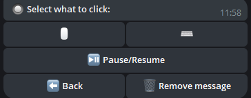

## 📝 Einführung

Willkommen bei **Steuere deinen PC mit einem Telegram-Bot**! Dieser leistungsstarke Bot ermöglicht es dir, deinen Computer remote über einfache Telegram-Befehle zu steuern, was deine Arbeit bequemer und effizienter macht.

Das Skript unterstützt sowohl einen einzelnen Administrator als auch mehrere Administratoren. Wenn du beispielsweise einen Familiencomputer verwendest, kannst du deinen Angehörigen Zugang gewähren.

Das Skript erhält regelmäßig kostenlose Updates. Solange ich die Möglichkeit und den Wunsch habe, werde ich die Funktionalität weiterhin unterstützen.

---

## 🌟 Hauptfunktionen

<div align="center">
  <table>
    <tr>
       <td align="center">
        <br>
        <b>🔧 Navigazione comoda tra fotocamera, desktop e microfono.</b><br>
        Vuoi attivare la sorveglianza o l'audio dal microfono? Scegli tu.
      </td>
      <td align="center">
        <br>
        <b>📸 Streaming dalle telecamere</b><br>
        Guarda lo streaming dalle tue telecamere per monitorare la tua casa.
      </td>
      <td align="center">
        <br>
        <b>📸 Streaming dal desktop</b><br>
        Osserva il tuo desktop da telefono o da un altro PC.
      </td>
      <td align="center">
        <br>
        <b>📸 Streaming dal microfono</b><br>
        Ascolta in tempo reale il suono del tuo microfono da telefono o da un altro PC.
      </td>
    </tr>
    <tr>
      <td align="center">
        <br>
        <b>🌍 Localizzazione</b><br>
        Il bot è disponibile in più lingue, garantendo comodità per gli utenti di tutto il mondo.
      </td>
      <td align="center">
        <br>
        <b>🤖 Configurazione del bot</b><br>
        Cambia il token, aggiungi o rimuovi amministratori direttamente dal bot.
      </td>
      <td align="center">
        <br>
        <b>🔧 Configurazione del bot</b><br>
        Configura e gestisci facilmente i parametri del bot.
      </td>
    </tr>
    <tr>
      <td align="center">
        <br>
        <b>🖥️ Pannello di navigazione del sistema</b><br>
        Navigazione comoda con il tuo sistema.
      </td>
      <td align="center">
        <br>
        <b>⚙️ Informazioni di sistema</b><br>
        Interagisci con l'alimentazione del PC, cambia il piano energetico, blocca lo schermo rapidamente o esci dal sistema.
      </td>
      <td align="center">
        <br>
        <b>🔋 Gestione dell'alimentazione</b><br>
        Gestisci le opzioni di alimentazione del tuo PC, inclusi spegnimento, riavvio, modalità ibernazione o pianificazione dello spegnimento.
      </td>
    </tr>
    <tr>
      <td align="center">
        <br>
        <b>🎵 Impostazioni audio</b><br>
        Configura e gestisci l'audio del tuo PC da remoto.
      </td>
      <td align="center">
        <br>
        <b>🖱️ Controllo dei dispositivi</b><br>
        Controlla mouse e tastiera da remoto.
      </td>
      <td align="center">
        <br>
        <b>🌤️ Controllo meteo</b><br>
        Ricevi informazioni meteo aggiornate direttamente nel bot!
      </td>
    </tr>
    <tr>
      <td align="center">
        <br>
        <b>🎥 Monitoraggio dei processi</b><br>
        Aggiungi processi alla blacklist per monitorarli o controlla l'attività di nuovi processi.
      </td>
      <td align="center">
        <br>
        <b>🗂️ Gestione dei processi</b><br>
        Visualizza e gestisci tutti i processi in esecuzione sul tuo PC, controlla il consumo di risorse e chiudili.
      </td>
      <td align="center">
        <br>
        <b>🌐 Pannello di controllo del browser</b><br>
        Gestisci le azioni nel browser senza uscire dalla chat.
      </td>
    </tr>
    <tr>
    <td align="center">
        <br>
        <b>🔧 Installatore di programmi</b><br>
        Hai reinstallato Windows? Non vuoi perdere tempo a cercare i programmi necessari su Internet? Usa questa funzionalità! Qui sono raccolte diverse applicazioni, organizzate per categorie. Puoi utilizzare la ricerca per categorie per trovare il programma che ti serve. Se non è nella lista, semplicemente utilizza il pulsante «Non nell'elenco», inserisci il nome del pacchetto e il sistema ti suggerirà un'opzione adatta.
      </td>
      <td align="center">
        <br>
        <b>🈸 Le mie applicazioni</b><br>
        Aggiungi le tue applicazioni alla lista, assegna loro un nome e avviale da questo menu.
      </td>
      <td align="center">
        <br>
        <b>🤡 Menu scherzi</b><br>
        Vuoi divertirti? Riproduci audio casuali, congela lo schermo o usa altre funzionalità divertenti.
      </td>
      <td align="center">
        <br>
        <b>🛠️ Preferenze</b><br>
        Configura il bot come preferisci. Vuoi ricevere foto come "Documento"? Attiva. Non vuoi notifiche sulle nuove versioni? Disattiva.
      </td>
    </tr>
    <tr>
      <td align="center">
        <br>
        <b>🔘 Clicker</b><br>
        Avvia un autoclicker per mouse o tastiera direttamente dal bot.
      </td>
      <td align="center">
        <br>
        <b>🖼️ Creazione di screenshot</b><br>
        Cattura e ricevi screenshot direttamente dal tuo PC su Telegram.
      </td>
      <td align="center">
        <br>
        <b>🖼️ Pannello funzioni spaventose</b><br>
        Vuoi metterti alla prova? Usa questo menu. Avvia un BSOD o chiudi tutti i processi!
      </td>
    </tr>
  </table>
</div>


---

## 📂 Datei- und Ordnerverwaltung

- **📁 Ordnernavigation:** Wechsle bequem zwischen Verzeichnissen.
- **📂 Ordner erstellen:** Erstelle neue Ordner in jedem Verzeichnis.
- **✏️ Ordner umbenennen:** Benenne vorhandene Ordner einfach um.
- **🔍 Verzeichnisse durchsuchen:** Finde Dateien und Ordner im aktuellen Verzeichnis.
- **🔄 Verzeichnis wechseln:** Wechsle schnell zwischen Verzeichnissen.

---

## 🛠️ Zusätzliche Tools

- **💻 Accesso alla riga di comando:** Esegui comandi nella console di Windows.
- **🚀 Avvio di file:** Apri qualsiasi file dalla tua directory.
- **📥 Download di file:** Scarica file direttamente sul tuo PC.
- **📤 Caricamento di file:** Carica file dal PC su Telegram.
- **🗑️ Eliminazione di file e cartelle:** Elimina file o cartelle per nome.
- **🔗 Download tramite link:** Scarica file tramite un link diretto.
- **🛜 Brute Force WiFi:** Trova la password per un punto di accesso selezionato.
- **👮 Anti-Furto:** Blocca lo schermo in caso di qualsiasi attività sul PC.
- **✍️ Scrittura di testo:** Puoi digitare testo sul PC direttamente dal bot.
- **🗣 Messaggio vocale:** Inviando un messaggio vocale al bot, verrà riprodotto sul PC con la tua voce.
- **📦 Appunti:** Visualizza gli appunti e modifica le informazioni in essi contenute.
- **🛡️ Firewall:** Attiva/disattiva la protezione del firewall direttamente dal bot.
- **🖥 Monitor:** Accendi/spegni il monitor direttamente dal bot.
- **⌨️ Blocco accesso:** Blocca l'accesso al mouse e alla tastiera per il tempo desiderato.

---

## 🖼️ Hintergrundbildverwaltung

- **📥 Hintergrundbilder herunterladen:** Speichere Hintergrundbilder auf deinem PC.
- **🎨 Hintergrundbilder festlegen:** Setze einen Desktop-Hintergrund, indem du ein Bild sendest.

---

## 💬 Nachrichten senden

- **📝 Notizen senden:** Sende Nachrichten an deinen PC, um Notizen zu erstellen.

## 🖥️ Unterstützte Systeme

| **System**       | **Unterstützt** | **Hinweise**                                                                                                                                                                 | **LINK**                                                                                                              |
|------------------|-----------------|-----------------------------------------------------------------------------------------------------------------------------------------------------------------------------|-----------------------------------------------------------------------------------------------------------------------|
| **Linux**        | ❌               |                                                                                                                                                                           |                                                                                                                       |
| **MacOS**        | ❌               |                                                                                                                                                                           |                                                                                                                       |
| **Windows 7**    | ✔️               | **Wenn Sie das Programm zum Autostart hinzufügen, aktivieren Sie es manuell in** `msconfig` > **Autostart.** |
| **Windows 8**    | ✔️               | 1. **Wenn Sie das Programm zum Autostart hinzufügen, aktivieren Sie es manuell im** `Task-Manager` > **Autostart.**                                                           |                                                                                                                       |
| **Windows 10**   | ✔️               |                                                                                                                                                                           |                                                                                                                       |
| **Windows 11**   | ✔️               |                                                                                                                                                                           |                                                                                                                       |

---

## ⚠️ Wichtige Informationen
- Dieses Skript ist proprietär und nicht Open-Source.
- Regelmäßige Updates werden bereitgestellt, um Sicherheit und Funktionalität zu gewährleisten.
- Was ist `update.exe`?  
  Diese Datei ist für die Aktualisierung des Skripts verantwortlich. Wenn Sie das Skript schnell aktualisieren möchten, ohne es manuell herunterzuladen, laden Sie einfach `update.exe` herunter und führen Sie es aus. Es wird automatisch die neueste Version des Skripts abrufen und installieren.
- Hinweis zur Antivirus-Überprüfung

  
  ```ini
  Einige Antivirenprogramme markieren diese Datei möglicherweise als Virus, da das Programm entwickelt wurde, um einen PC aus der Ferne zu steuern.
  Dies ist typisches Verhalten für solche Programme, da sie aufgrund ihrer Funktionen als potenziell gefährlich angesehen werden können.
  Dieses Skript ist jedoch absolut sicher, und Sie können es bedenkenlos verwenden.
  
  Es liegt in Ihrer Entscheidung, ob Sie es herunterladen oder nicht - es ist Ihr Recht, und wir respektieren Ihre Entscheidung. Wenn Sie jedoch der Quelle vertrauen und Ihren PC aus der Ferne steuern müssen,
  fügen Sie die Datei einfach der Liste der vertrauenswürdigen oder ausgeschlossenen Dateien in Ihrem Antivirenprogramm hinzu, um falsche Positivmeldungen zu vermeiden.
  
  Das Skript wird vollständig kostenlos bereitgestellt, und wir unterstützen es von Zeit zu Zeit mit Updates, um Sicherheit,
  Kompatibilität und erweiterte Funktionalität zu gewährleisten.
  Machen Sie sich keine Sorgen - das Herunterladen des Skripts ist sicher,
  und Sie erhalten ein leistungsstarkes Tool zur bequemen Verwaltung Ihres PCs über TELEGRAM!

- 🚨 Haftungsausschluss

  - Die Ersteller dieses Skripts sind nicht für mögliche rechtswidrige Handlungen von Benutzern verantwortlich, einschließlich der Verwendung des Programms, um anderen Schaden zuzufügen. Verwenden Sie dieses Skript nicht, um Handlungen vorzunehmen, die gegen Gesetze oder die Rechte anderer verstoßen. Sie müssen das Programm im Rahmen des Gesetzes und zum Nutzen von sich selbst und anderen verwenden.

---

## ⚙️ Skript-Konfiguration

*So konfigurieren Sie das Skript:*

1. **Führen Sie das Skript aus, um die Datei `settings.ini` zu generieren, in der Sie die Daten eingeben können (ein Beispiel ist unten gezeigt).**
2. **Alternativ können Sie eine Datei namens `settings.ini` erstellen, das Beispiel unten kopieren und in die Datei einfügen, dann mit IHREN Daten ersetzen.**

    ```ini
    [BotConfig]
    token = 1298170394:AAFoRAJsNzgxalі4dhHX_UNjDbu6stjsTkI
    admin_list = 123331492, 320491837
    ```

### Wo Sie die erforderlichen Daten erhalten

1. **Bot-Token:**  
   - Gehen Sie zu Telegram und suchen Sie nach [@BotFather](https://t.me/BotFather).  
   - Starten Sie einen Chat mit ihm und senden Sie den Befehl `/newbot`.  
   - Befolgen Sie die Anweisungen, um einen neuen Bot zu erstellen und Ihr einzigartiges Token zu erhalten.  
     Beispiel: `123456789:ABCDefghIJKLMNOPQRSTUVWXYZ`.  
   - Speichern Sie dieses Token für die Verwendung in der Datei `settings.ini`.

2. **Admin-ID(s):**  
   - Öffnen Sie Telegram und suchen Sie nach `MYID` und `getmyid`.  
   - Starten Sie einen Chat mit ihm, und es wird Ihre einzigartige Telegram-Benutzer-ID angezeigt.  
     Beispiel: `123456789`.  
   - Fügen Sie Ihre ID zur `admin_list` in der Datei `settings.ini` hinzu, um sicherzustellen, dass Sie Zugriff auf Admin-Befehle haben.
   - Wenn Sie mehrere Admins hinzufügen möchten, trennen Sie deren IDs mit einem Komma (`,`) wie oben gezeigt.
