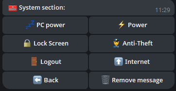

## 📝 Einführung

Willkommen bei **Steuere deinen PC mit einem Telegram-Bot**! Dieser leistungsstarke Bot ermöglicht es dir, deinen Computer remote über einfache Telegram-Befehle zu steuern, was deine Arbeit bequemer und effizienter macht.

Das Skript unterstützt sowohl einen einzelnen Administrator als auch mehrere Administratoren. Wenn du beispielsweise einen Familiencomputer verwendest, kannst du deinen Angehörigen Zugang gewähren.

Das Skript erhält regelmäßig kostenlose Updates. Solange ich die Möglichkeit und den Wunsch habe, werde ich die Funktionalität weiterhin unterstützen.

---

## 🌟 Hauptfunktionen

<div align="center">
  <table>
    <tr>
      <td align="center">
        <br>
        <b>🌍 Lokalisierung</b><br>
        Der Bot ist in mehreren Sprachen verfügbar, was ihn für Benutzer weltweit praktisch macht.
      </td>
      <td align="center">
        <br>
        <b>🖼️ Screenshot erstellen</b><br>
        Erstelle und erhalte Screenshots direkt von deinem PC.
      </td>
      <td align="center">
        <br>
        <b>🔧 Bot-Einstellungen</b><br>
        Konfiguriere und verwalte die Bot-Parameter einfach.
      </td>
    </tr>
    <tr>
      <td align="center">
        <br>
        <b>🖥️ Systemsteuerung</b><br>
        Überwache und steuere die Prozesse deines Systems.
      </td>
      <td align="center">
        <br>
        <b>⚙️ Systeminformationen</b><br>
        Sieh dir detaillierte Systeminformationen wie CPU-Auslastung, Speicherauslastung und vieles mehr an.
      </td>
      <td align="center">
        <br>
        <b>🔋 Energieverwaltung</b><br>
        Steuere die Energieeinstellungen deines PCs, einschließlich Herunterfahren, Neustart und Schlafmodus.
      </td>
    </tr>
  </table>
</div>

---

## 📂 Datei- und Ordnerverwaltung

- **📁 Ordnernavigation:** Wechsle bequem zwischen Verzeichnissen.
- **📂 Ordner erstellen:** Erstelle neue Ordner in jedem Verzeichnis.
- **✏️ Ordner umbenennen:** Benenne vorhandene Ordner einfach um.
- **🔍 Verzeichnisse durchsuchen:** Finde Dateien und Ordner im aktuellen Verzeichnis.
- **🔄 Verzeichnis wechseln:** Wechsle schnell zwischen Verzeichnissen.

---

## 🛠️ Zusätzliche Tools

- **💻 Zugang zur Eingabeaufforderung:** Führe Befehle in der Windows-Konsole aus.
- **🚀 Dateien ausführen:** Öffne beliebige Dateien aus deinem Verzeichnis.
- **📥 Dateien hochladen:** Lade Dateien direkt auf deinen PC.
- **📤 Dateien herunterladen:** Lade Dateien von deinem PC auf Telegram herunter.
- **🗑️ Dateien und Ordner löschen:** Lösche Dateien oder Ordner per Namen.
- **🔗 Dateien per Link herunterladen:** Lade Dateien über einen direkten Link herunter.

---

## 🖼️ Hintergrundbildverwaltung

- **📥 Hintergrundbilder herunterladen:** Speichere Hintergrundbilder auf deinem PC.
- **🎨 Hintergrundbilder festlegen:** Setze einen Desktop-Hintergrund, indem du ein Bild sendest.

---

## 💬 Nachrichten senden

- **📝 Notizen senden:** Sende Nachrichten an deinen PC, um Notizen zu erstellen.

## 🖥️ Unterstützte Systeme

| **System**       | **Unterstützt** | **Hinweise**                                                                                                                                                                 | **LINK**                                                                                                              |
|------------------|-----------------|-----------------------------------------------------------------------------------------------------------------------------------------------------------------------------|-----------------------------------------------------------------------------------------------------------------------|
| **Linux**        | ❌               |                                                                                                                                                                           |                                                                                                                       |
| **MacOS**        | ❌               |                                                                                                                                                                           |                                                                                                                       |
| **Windows 7**    | ✔️               | 1. **Es kann ein Fehler auftreten:** `api-ms-win-core-path-l1-1-0.dll`. **Laden Sie die erforderliche Datei herunter, um dieses Problem zu beheben.**<br>2. **Wenn Sie das Programm zum Autostart hinzufügen, aktivieren Sie es manuell in** `msconfig` > **Autostart.** | [Link zur Seite](https://github.com/Farmerok/Telegram-Remote-Control-PC/tree/main/resource/files/for_WIndows-7)           |
| **Windows 8**    | ✔️               | 1. **Wenn Sie das Programm zum Autostart hinzufügen, aktivieren Sie es manuell im** `Task-Manager` > **Autostart.**                                                           |                                                                                                                       |
| **Windows 10**   | ✔️               |                                                                                                                                                                           |                                                                                                                       |
| **Windows 11**   | ✔️               |                                                                                                                                                                           |                                                                                                                       |

---

## ⚠️ Wichtige Informationen
- Dieses Skript ist proprietär und nicht Open-Source.
- Regelmäßige Updates werden bereitgestellt, um Sicherheit und Funktionalität zu gewährleisten.
- Was ist `update.exe`?  
  Diese Datei ist für die Aktualisierung des Skripts verantwortlich. Wenn Sie das Skript schnell aktualisieren möchten, ohne es manuell herunterzuladen, laden Sie einfach `update.exe` herunter und führen Sie es aus. Es wird automatisch die neueste Version des Skripts abrufen und installieren.
- Hinweis zur Antivirus-Überprüfung

  
  ```ini
  Einige Antivirenprogramme markieren diese Datei möglicherweise als Virus, da das Programm entwickelt wurde, um einen PC aus der Ferne zu steuern.
  Dies ist typisches Verhalten für solche Programme, da sie aufgrund ihrer Funktionen als potenziell gefährlich angesehen werden können.
  Dieses Skript ist jedoch absolut sicher, und Sie können es bedenkenlos verwenden.
  
  Es liegt in Ihrer Entscheidung, ob Sie es herunterladen oder nicht - es ist Ihr Recht, und wir respektieren Ihre Entscheidung. Wenn Sie jedoch der Quelle vertrauen und Ihren PC aus der Ferne steuern müssen,
  fügen Sie die Datei einfach der Liste der vertrauenswürdigen oder ausgeschlossenen Dateien in Ihrem Antivirenprogramm hinzu, um falsche Positivmeldungen zu vermeiden.
  
  Das Skript wird vollständig kostenlos bereitgestellt, und wir unterstützen es von Zeit zu Zeit mit Updates, um Sicherheit,
  Kompatibilität und erweiterte Funktionalität zu gewährleisten.
  Machen Sie sich keine Sorgen - das Herunterladen des Skripts ist sicher,
  und Sie erhalten ein leistungsstarkes Tool zur bequemen Verwaltung Ihres PCs über TELEGRAM!

- 🚨 Haftungsausschluss

  - Die Ersteller dieses Skripts sind nicht für mögliche rechtswidrige Handlungen von Benutzern verantwortlich, einschließlich der Verwendung des Programms, um anderen Schaden zuzufügen. Verwenden Sie dieses Skript nicht, um Handlungen vorzunehmen, die gegen Gesetze oder die Rechte anderer verstoßen. Sie müssen das Programm im Rahmen des Gesetzes und zum Nutzen von sich selbst und anderen verwenden.

---

## ⚙️ Skript-Konfiguration

*So konfigurieren Sie das Skript:*

1. **Führen Sie das Skript aus, um die Datei `settings.ini` zu generieren, in der Sie die Daten eingeben können (ein Beispiel ist unten gezeigt).**
2. **Alternativ können Sie eine Datei namens `settings.ini` erstellen, das Beispiel unten kopieren und in die Datei einfügen, dann mit IHREN Daten ersetzen.**

    ```ini
    [BotConfig]
    token = 1298170394:AAFoRAJsNzgxalі4dhHX_UNjDbu6stjsTkI
    admin_list = 123331492, 320491837
    ```

### Wo Sie die erforderlichen Daten erhalten

1. **Bot-Token:**  
   - Gehen Sie zu Telegram und suchen Sie nach [@BotFather](https://t.me/BotFather).  
   - Starten Sie einen Chat mit ihm und senden Sie den Befehl `/newbot`.  
   - Befolgen Sie die Anweisungen, um einen neuen Bot zu erstellen und Ihr einzigartiges Token zu erhalten.  
     Beispiel: `123456789:ABCDefghIJKLMNOPQRSTUVWXYZ`.  
   - Speichern Sie dieses Token für die Verwendung in der Datei `settings.ini`.

2. **Admin-ID(s):**  
   - Öffnen Sie Telegram und suchen Sie nach `MYID` und `getmyid`.  
   - Starten Sie einen Chat mit ihm, und es wird Ihre einzigartige Telegram-Benutzer-ID angezeigt.  
     Beispiel: `123456789`.  
   - Fügen Sie Ihre ID zur `admin_list` in der Datei `settings.ini` hinzu, um sicherzustellen, dass Sie Zugriff auf Admin-Befehle haben.
   - Wenn Sie mehrere Admins hinzufügen möchten, trennen Sie deren IDs mit einem Komma (`,`) wie oben gezeigt.
