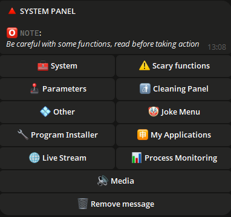
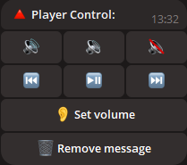

## 📝 Introduzione

Benvenuto in **PCGuardControl**! Questo potente strumento ti consente di gestire il tuo computer da remoto tramite comandi semplici su Telegram, rendendo il tuo lavoro più comodo ed efficiente.

Lo script supporta uno o più amministratori. Ad esempio, su un computer familiare, puoi concedere l’accesso ai tuoi cari.

Rilasciamo regolarmente aggiornamenti gratuiti per mantenere la sicurezza e la funzionalità dello script.

---

## 🌟 Funzionalità principali

<div align="center">
  <table>
    <tr>
      <td align="center">
        <br>
        <b>🔧 Navigazione intuitiva</b><br>
        Passa facilmente tra la gestione di fotocamera, desktop e microfono.
      </td>
      <td align="center">
        <br>
        <b>📸 Videosorveglianza</b><br>
        Trasmetti video dalle tue fotocamere per monitorare la casa.
      </td>
      <td align="center">
        <br>
        <b>📸 Streaming del desktop</b><br>
        Osserva il tuo desktop da un telefono o un altro dispositivo.
      </td>
      <td align="center">
        <br>
        <b>📸 Streaming audio</b><br>
        Ascolta l’audio del microfono in tempo reale.
      </td>
    </tr>
    <tr>
      <td align="center">
        <br>
        <b>🌍 Supporto multilingue</b><br>
        Il bot è disponibile in più lingue per utenti di tutto il mondo.
      </td>
      <td align="center">
        <br>
        <b>🤖 Configurazione del bot</b><br>
        Modifica il token, aggiungi o rimuovi amministratori direttamente dal bot.
      </td>
      <td align="center">
        <br>
        <b>🔧 Gestione impostazioni</b><br>
        Configura i parametri del bot in modo rapido e semplice.
      </td>
    </tr>
    <tr>
      <td align="center">
        <br>
        <b>🖥️ Gestione del sistema</b><br>
        Interfaccia pratica per interagire con il sistema.
      </td>
      <td align="center">
        <br>
        <b>⚙️ Informazioni di sistema</b><br>
        Gestisci l’alimentazione, i piani energetici, il blocco dello schermo o la disconnessione.
      </td>
      <td align="center">
        <br>
        <b>🔋 Gestione dell’alimentazione</b><br>
        Spegni, riavvia, iberna o programma lo spegnimento del PC.
      </td>
    </tr>
    <tr>
      <td align="center">
        <br>
        <b>🎵 Impostazioni audio</b><br>
        Regola l’audio del tuo PC da remoto.
      </td>
      <td align="center">
        <br>
        <b>🖱️ Controllo dispositivi</b><br>
        Controlla mouse e tastiera da remoto.
      </td>
      <td align="center">
        <br>
        <b>🌤️ Meteo</b><br>
        Ricevi informazioni meteo aggiornate direttamente nel bot.
      </td>
    </tr>
    <tr>
      <td align="center">
        <br>
        <b>🎥 Monitoraggio processi</b><br>
        Traccia i processi aggiungendoli a una blacklist e controlla i nuovi avvii.
      </td>
      <td align="center">
        <br>
        <b>🗂️ Gestione processi</b><br>
        Visualizza i processi attivi, le loro risorse e terminali se necessario.
      </td>
      <td align="center">
        <br>
        <b>🌐 Controllo del browser</b><br>
        Esegui azioni nel browser direttamente dalla chat.
      </td>
    </tr>
    <tr>
      <td align="center">
        <br>
        <b>🔧 Installazione programmi</b><br>
        Reinstallato Windows? Trova programmi per categoria o ricerca. Se non sono elencati, inserisci il nome per installarli.
      </td>
      <td align="center">
        <br>
        <b>🈸 Le mie applicazioni</b><br>
        Aggiungi applicazioni a una lista, assegna loro nomi e avviale da questo menu.
      </td>
      <td align="center">
        <br>
        <b>🤡 Funzioni divertenti</b><br>
        Divertiti con chi usa il tuo PC: riproduci audio casuale, una melodia o blocca lo schermo.
      </td>
      <td align="center">
        <br>
        <b>🛠️ Personalizzazione</b><br>
        Personalizza il bot: formato delle immagini, notifiche di aggiornamento, blocco schermo, ecc.
      </td>
    </tr>
    <tr>
      <td align="center">
        <br>
        <b>🔘 Autoclicker</b><br>
        Avvia un autoclicker per mouse o tastiera direttamente dal bot.
      </td>
      <td align="center">
        <br>
        <b>🖼️ Screenshot</b><br>
        Cattura e ricevi screenshot del tuo PC su Telegram.
      </td>
      <td align="center">
        <br>
        <b>🖼️ Funzioni estreme</b><br>
        Mettiti alla prova: attiva un BSOD o chiudi tutti i processi!
      </td>
    </tr>
  </table>
</div>

---

## 📂 Gestione di file e cartelle

- **📁 Navigazione cartelle:** Passa rapidamente tra le directory.
- **📂 Creazione cartelle:** Crea nuove cartelle ovunque.
- **✏️ Rinominazione:** Modifica i nomi delle cartelle esistenti.
- **🔍 Scansione:** Esamina file e cartelle nella directory attuale.
- **🔄 Cambio directory:** Naviga facilmente tra le cartelle.

---

## 🛠️ Funzionalità aggiuntive

- **💻 Riga di comando:** Esegui comandi nella console di Windows.
- **🚀 Esecuzione file:** Apri file da qualsiasi directory.
- **📥 Caricamento file:** Invia file al tuo PC.
- **📤 Download file:** Scarica file dal tuo PC su Telegram.
- **🗑️ Eliminazione:** Elimina file o cartelle per nome.
- **🔗 Download tramite link:** Scarica file tramite link diretti.
- **👮 Antifurto:** Blocca lo schermo in caso di attività sul PC.
- **✍️ Inserimento testo:** Digita testo sul PC tramite il bot.
- **🗣 Messaggi vocali:** Invia messaggi vocali che verranno riprodotti sul PC.
- **📦 Appunti:** Visualizza e modifica il contenuto degli appunti.
- **🛡️ Firewall:** Attiva/disattiva la protezione direttamente nel bot.
- **🖥 Gestione monitor:** Accendi/spegni il monitor.
- **⌨️ Blocco input:** Limita l’accesso a mouse e tastiera.
- **🪫 Controllo batteria:** Ricevi notifiche per batteria scarica.
- **🗂 Riavvio Esplora risorse:** Riavvia Esplora risorse di Windows.

---

## 🖼️ Gestione sfondi

- **📥 Download sfondi:** Salva immagini sul tuo PC.
- **🎨 Impostazione sfondi:** Cambia lo sfondo del desktop inviando un’immagine.

---

## 💬 Notifiche

- **📝 Invio notifiche:** Crea note e notifiche di sistema sul tuo PC.

---

## 🖥️ Sistemi supportati

| **Sistema**      | **Supporto** | **Note**                                                                                   | **Link** |
|------------------|--------------|--------------------------------------------------------------------------------------------|----------|
| **Linux**        | ❌           |                                                                                            |          |
| **MacOS**        | ❌           |                                                                                            |          |
| **Windows 7**    | ✔️           | Attiva manualmente il programma in `msconfig` > **Avvio**.                                  |          |
| **Windows 8**    | ✔️           | Attiva manualmente il programma in `Gestione attività` > **Avvio**.                         |          |
| **Windows 10**   | ✔️           |                                                                                            |          |
| **Windows 11**   | ✔️           |                                                                                            |          |

---

## ⚠️ Informazioni importanti

- Lo script è proprietario e non open-source.
- Gli aggiornamenti regolari garantiscono sicurezza e nuove funzionalità.
- **Cos’è `update.exe`?**  
  Questo file consente l’aggiornamento automatico dello script. Eseguilo per scaricare l’ultima versione senza installazione manuale.
- **⚠️ Non usare lo stesso token in più programmi contemporaneamente** — solo in un’applicazione.
- **Riguardo alle rilevazioni antivirus:**

  ```ini
  Alcuni antivirus potrebbero segnalare lo script come minaccia a causa della sua funzione di controllo remoto.
  Questo è un comportamento comune per questo tipo di programmi a causa delle loro funzionalità.
  Lo script è completamente sicuro da usare.

  Decidi tu se scaricarlo o meno — è un tuo diritto, e lo rispettiamo. Se ti fidi della fonte,
  aggiungi il file alle esclusioni del tuo antivirus per evitare falsi positivi.

  Lo script è fornito gratuitamente, e lo aggiorneremo per garantire sicurezza e funzionalità.
  Il download è sicuro, e otterrai uno strumento potente per gestire il tuo PC tramite Telegram!
  ```

- **🚨 Disclaimer:**  
  Gli sviluppatori non sono responsabili per l’uso illegale dello script. Non utilizzarlo per azioni che violino la legge o i diritti altrui. Usa il programma solo a fini legali.

---

## ⚙️ Configurazione dello script

Per configurare:

1. Esegui lo script per generare il file `settings.ini` dove inserire i dati (esempio sotto).
2. Oppure crea un file `settings.ini`, copia l’esempio e sostituisci con i tuoi dati.

    ```ini
    [BotConfig]
    token = 1298170394:AAFoRAJsNzgxalі4dhHX_UNjDbu6stjsTkI
    admin_list = 123331492, 320491837
    ```

### Come ottenere i dati

1. **Token del bot:**  
   - Cerca [@BotFather](https://t.me/BotFather) su Telegram.  
   - Invia il comando `/newbot` e segui le istruzioni per creare un bot.  
   - Ottieni il token, ad esempio: `123456789:ABCDefghIJKLMNOPQRSTUVWXYZ`.  
   - Salvalo in `settings.ini`.

2. **ID amministratore:**  
   - Cerca `@userinfobot` o `@getmyid_bot` su Telegram.  
   - Avvia una chat per ottenere il tuo ID Telegram, ad esempio: `123456789`.  
   - Aggiungi l’ID a `admin_list` in `settings.ini`. Per più amministratori, separa gli ID con virgole (`,`).