## 📝 Вступ

Ласкаво просимо до **Керуй своїм ПК через Telegram-бота**! Цей потужний бот дозволяє віддалено керувати вашим комп'ютером за допомогою простих команд Telegram, що робить вашу роботу зручнішою та ефективнішою.

Скрипт підтримує як одного адміністратора, так і кількох, наприклад, якщо ви використовуєте сімейний комп'ютер, ви можете надати доступ своїм близьким.

Скрипт регулярно отримує безкоштовні оновлення. Поки я маю можливість і бажання, я буду підтримувати його функціональність.

---

## 🌟 Основні можливості

<div align="center">
  <table>
   <tr>
      <td align="center">
        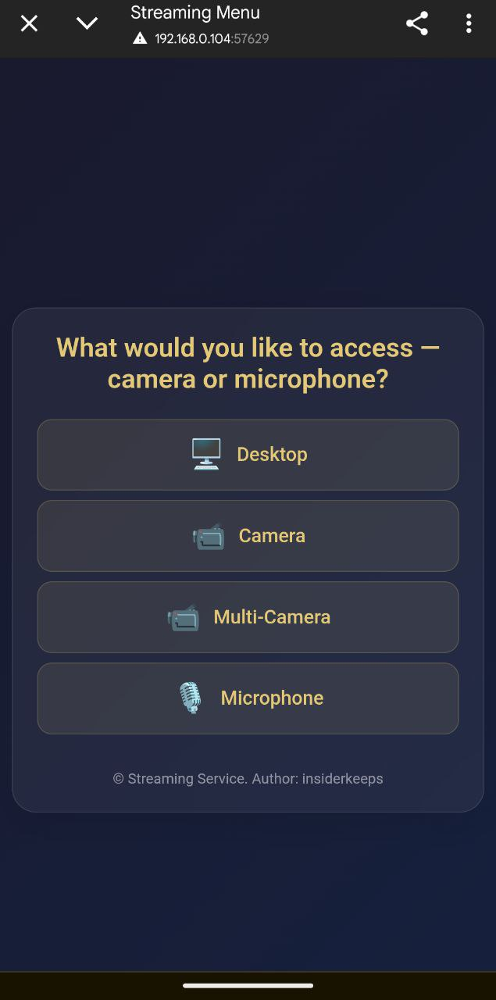<br>
        <b>🔧 Зручна навігація між камерою або робочим столом</b><br>
        Бажаєте за чимось спостерігати? Обирайте.
      </td>
      <td align="center">
        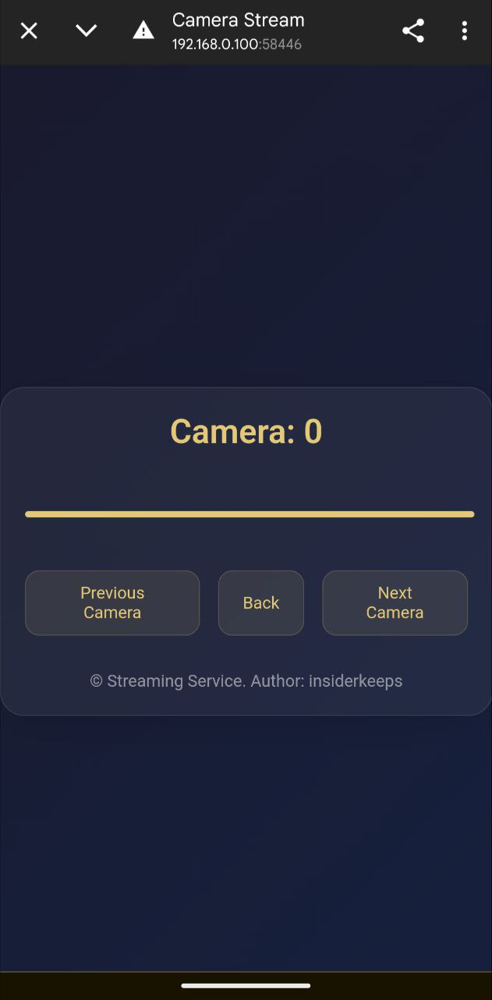<br>
        <b>📸 Трансляція з камер</b><br>
        Дивіться трансляцію зі своїх камер, організовуючи відеоспостереження за своїм домом.
      </td>
      <td align="center">
        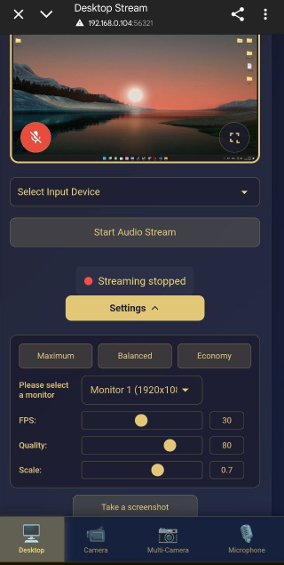<br>
        <b>📸 Трансляція з екрана</b><br>
        Спостерігайте за своїм робочим столом з телефону або іншого ПК.
      </td>
    </tr>
    <tr>
      <td align="center">
        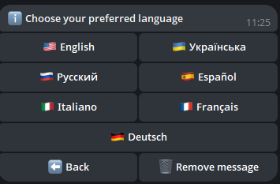<br>
        <b>🌍 Локалізація</b><br>
        Бот доступний кількома мовами, забезпечуючи зручність використання для користувачів майже з усього світу.
      </td>
      <td align="center">
        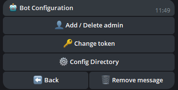<br>
        <b>🤖 Конфігурація бота</b><br>
        Змінюйте токен, додавайте адміністраторів або видаляйте їх прямо з бота.
      </td>
      <td align="center">
        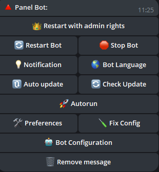<br>
        <b>🔧 Налаштування бота</b><br>
        Легко налаштовуйте та керуйте параметрами бота.
      </td>
    </tr>
    <tr>
      <td align="center">
        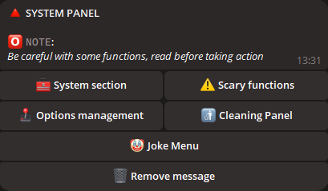<br>
        <b>🖥️ Панель навігації управління системою</b><br>
        Зручна навігація вашою системою.
      </td>
      <td align="center">
        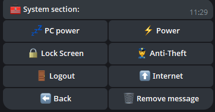<br>
        <b>⚙️ Інформація про систему</b><br>
        Взаємодійте з живленням ПК, змінюйте план електроживлення, блокуйте екран, швидко виходьте із системи.
      </td>
      <td align="center">
        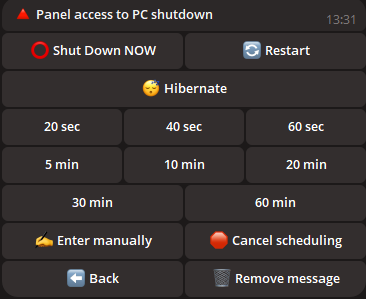<br>
        <b>🔋 Управління живленням</b><br>
        Керуйте опціями живлення вашого ПК, включаючи: вимкнення, перезавантаження, режим гібернації або планування вимкнення ПК.
      </td>
    </tr>
    <tr>
      <td align="center">
        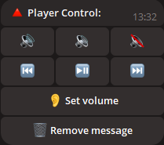<br>
        <b>🎵 Налаштування звуку</b><br>
        Налаштовуйте та керуйте звуком вашого ПК віддалено.
      </td>
      <td align="center">
        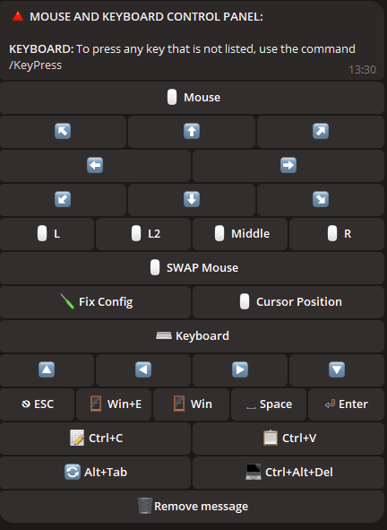<br>
        <b>🖱️ Управління пристроями</b><br>
        Віддалено керуйте мишею та клавіатурою.
      </td>
      <td align="center">
        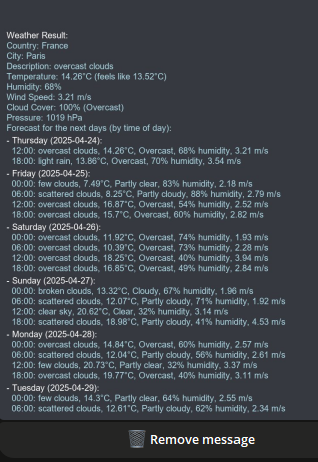<br>
        <b>🌤️ Перевірка погоди</b><br>
        Отримуйте актуальну інформацію про погоду прямо в боті!
      </td>
    </tr>
    <tr>
      <td align="center">
        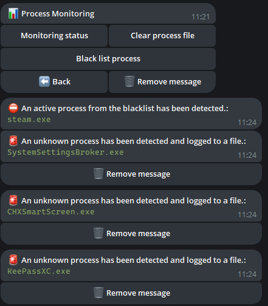<br>
        <b>🎥 Моніторинг процесів</b><br>
        Додавайте у чорний список потрібний процес для спостереження, слідкуйте за активністю нових процесів.
      </td>
      <td align="center">
        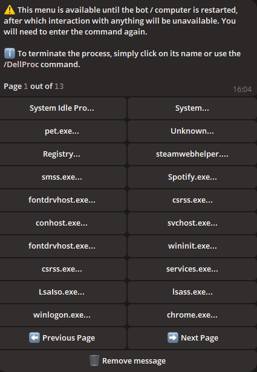<br>
        <b>🗂️ Управління процесами</b><br>
        Переглядайте та керуйте всіма запущеними процесами на вашому ПК, перевіряйте їх споживання ресурсів та закривайте їх.
      </td>
      <td align="center">
        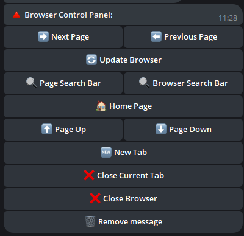<br>
        <b>🌐 Панель управління браузером</b><br>
        Керуйте діями у браузері, не виходячи з чату.
      </td>
    </tr>
    <tr>
      <td align="center">
        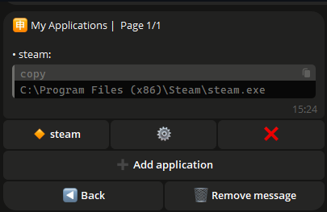<br>
        <b>🈸 Мої додатки</b><br>
        Додавайте свої додатки у список, давайте їм власну назву та запускайте їх із цього меню.
      </td>
      <td align="center">
        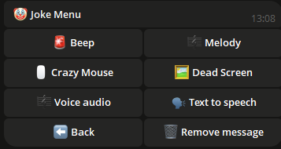<br>
        <b>🤡 Жартівливе меню</b><br>
        Можливо, вам захочеться повеселитися, якщо ви відійдете від комп'ютера, а хтось вирішить отримати до нього доступ. 
        У такому разі ви можете відтворити випадкове аудіо, увімкнути випадкову мелодію, 
        заморозити екран із повною відсутністю доступу до миші та клавіатури або скористатися іншим функціоналом.
      </td>
      <td align="center">
        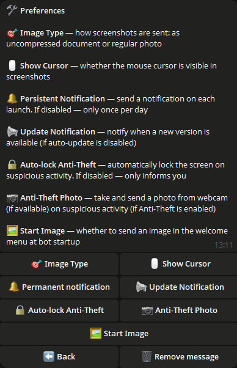<br>
        <b>🛠️ Налаштування</b><br>
        Налаштовуйте бота, як вам зручно.  
        Хочете отримувати фото у вигляді "Документа"? Увімкніть.  
        Не хочете отримувати сповіщення про нову версію? Вимкніть.  
        Не хочете блокування екрана при виявленні активності? Вимкніть.
      </td>
    </tr>
    <tr>
      <td align="center">
        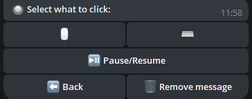<br>
        <b>🔘 Клікер</b><br>
        Запускайте автоклікер для миші або клавіатури прямо з бота.
      </td>
      <td align="center">
        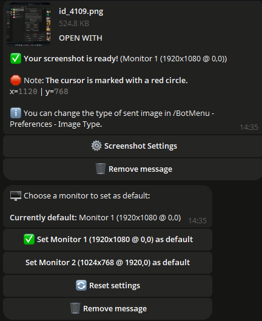<br>
        <b>🖼️ Створення скріншотів</b><br>
        Робіть і отримуйте скріншоти прямо з вашого ПК у Telegram.
      </td>
      <td align="center">
        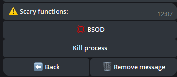<br>
        <b>🖼️ Панель страшних функцій</b><br>
        Хочете випробувати себе? Вам у це меню.  
        Запускайте BSOD або закривайте всі процеси!
      </td>
    </tr>
  </table>
</div>


---

## 📂 Керування файлами і папками

- **📁 Переміщення між папками:** Зручно перемикайтеся між директоріями.
- **📂 Створення папок:** Створюйте нові папки в будь-якій директорії.
- **✏️ Перейменування папок:** Легко перейменовуйте існуючі папки.
- **🔍 Сканація директорій:** Знаходьте файли і папки в поточній директорії.
- **🔄 Зміна директорії:** Швидко перемикайтеся між директоріями.

---

## 🛠️ Додаткові утиліти

- **💻 Доступ до командного рядка:** Виконуйте команди в консолі Windows.
- **🚀 Запуск файлів:** Відкривайте будь-які файли зі своєї директорії.
- **📥 Завантаження файлів:** Завантажуйте файли безпосередньо на ваш ПК.
- **📤 Завантаження файлів:** Завантажуйте файли з ПК у Telegram.
- **🗑️ Видалення файлів і папок:** Видаляйте файли або папки за іменем.
- **🔗 Завантаження за посиланням:** Завантажуйте файли за прямим посиланням.
- **🛜 БрутФорс WiFi:** Підбирайте пароль до вибраної точки доступу.
- **👮 Анти-Злодій:** Блокування екрана при будь-якій активності ПК.
- **✍️ Набір тексту:** Ви можете друкувати текст на ПК прямо з бота.
- **🗣 Голосове повідомлення:** Надіславши боту голосове повідомлення, воно буде озвучене на ПК вашим голосом.
- **📦 Буфер обміну:** Переглядайте буфер обміну, змінюйте в ньому інформацію.
- **🛡️ Брандмауер:** Увімкніть/вимкніть захист брандмауера прямо в боті.
- **🖥 Монітор:** Увімкніть/вимкніть монітор прямо в боті.
- **⌨️ Блокування доступу:** Заблокуйте доступ до миші та клавіатури на бажаний час.

---

## 🖼️ Керування шпалерами

- **📥 Завантаження шпалер:** Зберігайте шпалери на свій ПК.
- **🎨 Встановлення шпалер:** Встановлюйте шпалери робочого столу, надіславши зображення.

---

## 💬 Надсилання повідомлень

- **📝 Надсилання нотаток:** Надсилайте повідомлення на свій ПК для створення нотаток.

## 🖥️ Підтримувані системи

| **Система**      | **Підтримується** | **Примітки**                                                                                                                                                               | **Посилання**                                                                                                           |
|------------------|-------------------|-------------------------------------------------------------------------------------------------------------------------------------------------------------------------|------------------------------------------------------------------------------------------------------------------------|
| **Linux**        | ❌                |                                                                                                                                                                           |                                                                                                                        |
| **MacOS**        | ❌                |                                                                                                                                                                           |                                                                                                                        |
| **Windows 7**    | ✔️                | **Якщо додаєте програму до автозапуску, увімкніть її вручну в** `msconfig` > **Автозапуск.** |
| **Windows 8**    | ✔️                | 1. **Якщо додаєте програму до автозапуску, увімкніть її вручну в** `Диспетчер задач` > **Автозапуск.**                                                                      |                                                                                                                        |
| **Windows 10**   | ✔️                |                                                                                                                                                                           |                                                                                                                        |
| **Windows 11**   | ✔️                |                                                                                                                                                                           |                                                                                                                        |

---

## ⚠️ Важлива інформація
- Цей скрипт є власницьким і не є відкритим вихідним кодом.
- Регулярні оновлення надаються для підтримки безпеки та функціональності.
- Що таке `update.exe`?  
  Цей файл відповідає за оновлення скрипта. Якщо ви хочете швидко оновити скрипт без завантаження його вручну, просто завантажте і запустіть `update.exe`. Він автоматично завантажить і встановить останню версію скрипта.
- Примітка щодо сканування антивірусом

  
  ```ini
  Деякі антивірусні програми можуть позначити цей файл як вірус, оскільки програма призначена для віддаленого управління ПК.
  Це типова поведінка для таких програм, оскільки їх функції можуть вважатися потенційно небезпечними.
  Однак цей скрипт абсолютно безпечний, і ви можете безпечно його використовувати.
  
  Ви вирішуєте, завантажувати чи ні - це ваше право, і ми поважаємо ваше рішення. Тим не менш,
  якщо ви довіряєте джерелу і вам потрібно віддалено керувати ПК,
  просто додайте файл до довірених або виключених списків вашого антивіруса, щоб уникнути хибних спрацьовувань.
  
  Скрипт надається безкоштовно, і ми будемо підтримувати його оновленнями для забезпечення безпеки,
  сумісності та покращеної функціональності.
  Не хвилюйтеся - завантаження скрипта безпечне,
  і ви отримаєте потужний інструмент для зручного віддаленого управління вашим ПК через TELEGRAM!

- 🚨 Відмова від відповідальності

  - Творці цього скрипта не несуть відповідальності за можливі незаконні дії користувачів, зокрема використання програми для завдання шкоди іншим особам. Не використовуйте цей скрипт для дій, які можуть порушити закони чи права інших осіб. Ви повинні використовувати програму в межах закону та на благо себе та інших.

---

## ⚙️ Налаштування скрипта

*Для налаштування скрипта:*

1. **Запустіть скрипт для створення файлу `settings.ini`, в якому можна ввести дані (приклад наведено нижче).**
2. **Або створіть файл з іменем `settings.ini`, скопіюйте наведений нижче приклад і вставте його в файл, потім замініть на ваші дані.**

    ```ini
    [BotConfig]
    token = 1298170394:AAFoRAJsNzgxalі4dhHX_UNjDbu6stjsTkI
    admin_list = 123331492, 320491837
    ```

### Де отримати необхідні дані

1. **Токен бота:**  
   - Перейдіть в Telegram і знайдіть [@BotFather](https://t.me/BotFather).  
   - Почніть чат з ним і відправте команду `/newbot`.  
   - Дотримуйтесь інструкцій для створення нового бота та отримання унікального токена.  
     Приклад: `123456789:ABCDefghIJKLMNOPQRSTUVWXYZ`.  
   - Збережіть цей токен для використання в файлі `settings.ini`.

2. **ID адміністратора(ів):**  
   - Відкрийте Telegram і знайдіть `MYID` і `getmyid`.  
   - Почніть чат з ним, і він відобразить ваш унікальний Telegram ID.  
     Приклад: `123456789`.  
   - Додайте свій ID до `admin_list` у файлі `settings.ini`, щоб мати доступ до адміністративних команд.
   - Якщо хочете додати кілька адміністраторів, розділіть їх ID комою (`,`) як показано вище.

